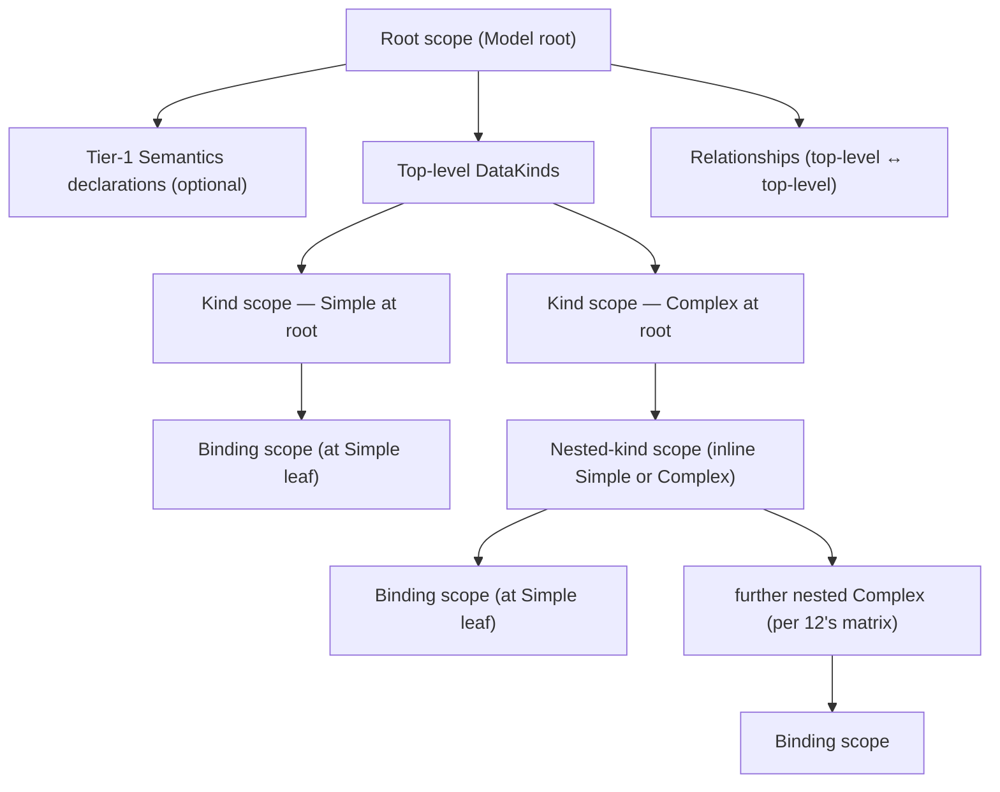

# 11. Names and Scopes

> **Struct ownership (2026-04-17 consolidation).** Struct shapes for the Semantics catalog (`Dimension`, `Measure`, `Metric`, `AdditivityType`, `SemiAdditive`, `AiContext`, `Keys`) are ratified in [`18 §4`–`§9`](./18_entities.md). This doc owns the *scope chain*, the *identity and lookup rules*, the *planner contract for `Additivity`*, the *`Constraint` evaluation lifecycle*, and the *cross-kind reference invariant*. Where body sections below cite `ColumnMapping`, read `SemanticMapping` per `18 §10`; where they cite `DimensionType::{Categorical,Continuous,...}`, read `DimensionType` per `18 §4.2`. Scope-chain and lookup content is unaffected.
>
> **Status:** ratified across all sections. §8 (Constraint) realizes the generic per-carrier framework with Measure and Metric as v1 carriers; Dimension, Filter, Key, DataKind are reserved carriers for future-design extensions.

## 1. Purpose and Scope

`11` ratifies the naming and scoping rules a `SemanticModel` must satisfy, and the lookup mechanics `compile` applies when producing a `SemanticManifest`. It is the first foundations doc after `10` because every subsequent doc refers to Semantics by name; nothing downstream (`12`–`17`, `20`–`25`, `31`–`37`) is well-defined without a pinned scope model.

**What `11` ratifies:**

- The **scope chain** (§2) — four named levels, strictly tree-shaped.
- The **identity rule** for Semantics names (§3) — global identity, unified namespace.
- The **YAML declaration form** (§4) — single-form rule with scalar shorthand, field-driven role.
- The **shape-vs-resolution-variant** boundary (§5) — which fields lock across all occurrences of a name; which may differ per DataKind.
- The **Semantics element catalog** (§6) — Dimension, Measure, Metric, Filter, Key.
- **`Additivity`** (§7) as a first-class Measure / Metric property, including SemiAdditive axis encoding and the per-variant planner contract.
- **`Constraint`** (§8) authoring location — DSL grammar, evaluation boundary, and derivation semantics are TBD.
- The **cross-kind reference rule** (§9) — Relationship-required invariant + compile / plan split.
- **Nested-kind structural labels** (§10) — non-Semantics naming at nested scope levels.
- The **lookup algorithm** (§11) — how `compile` resolves a named reference.
- The **Precondition catalog** (§12) for name-related checks run by `validate` and `compile`.

**What `11` does NOT specify** (forward-refs):

- Which container types may nest which child types, and in what forms — `12`.
- `DataType` variants and `Grain` axes — `13`.
- `Expr` / `ExprSource` grammar, function registry, expression-level name resolution mechanics — `14`.
- `Binding`, `SemanticMapping`, `PhysicalSource`, and binding-coverage rules — `15` (struct shape for `SemanticMapping` lives in `18 §10`).
- `Relationship`, `ComposedSemanticInterface`, and cross-kind-walk semantics at plan time — `16`.
- `TemporalShape` and its effect on `Additivity` defaults — `17`.
- Per-DataKind-variant strategies (Grainset rollup choice, Unionset branch assembly, Joinset path walking) and `Constraint` evaluation — `20`–`25`.

**Key invariants from `00` that `11` directly upholds:**

- **I5** — all name resolution is compile-time work, captured in the `SemanticManifest`; nothing resolvable remains for `plan`.
- **I8** — the `SemanticManifest` carries every index `plan` needs; `11`'s lookup algorithm feeds those indices.
- Global identity and unified-namespace rules (§3) refine `00 §4.1` for Semantics.

## 2. The Scope Chain

Four named levels, strictly tree-shaped (no DAG). Every declaration and every reference lives in exactly one scope level.

| Level | Owner | What it holds | Exposed to consumers? |
|---|---|---|---|
| Root scope | Model root | optional Tier-1 Semantics shape declarations; top-level DataKind containers; global `Relationship` block | — (Model root is a container, not queryable) |
| Kind scope | a top-level DataKind | the DataKind's declared `SemanticInterface` (Dimensions / Measures / Metrics / Filters / Keys); local-to-kind resolution variants (per §5) | yes — the DataKind's interface is the consumer-facing contract |
| Nested-kind scope | an inline nested DataKind under a top-level Complex | strategy-specific structural configuration; further nested children; optional non-Semantics structural label | no — nested kinds declare no interface |
| Binding scope | a Simple leaf's `Binding` | `SemanticMapping` to `PhysicalSource`(s) | no — purely physical realization |

**Tree shape — no referenced children.** A Complex DataKind's children are always **inline**; there is no `ref:` form that points to a top-level DataKind as a member of another Complex. Reuse across top-level DataKinds happens through (a) Semantics naming (global identity makes `revenue` in two different DataKinds the same logical thing), (b) `PhysicalSource` reuse at the Binding layer (ratified in `15`), and (c) `Relationship` declarations at Model root (ratified in `16`). No scope-level reuse mechanism exists, by design — it would turn the scope tree into a DAG and complicate every rule that follows.

### 2.1 Diagram — the scope chain



**Notes on the diagram.**

- Tier-1 Semantics declarations under Root scope are *not* DataKinds; they are shape-only contracts reusable by any top-level DataKind (§4).
- Relationships live at Root scope and connect pairs of top-level DataKinds only. They do not traverse into nested-kind scope, and they are not a member of any Complex.
- Nested-kind scope has no interface; its role is structural. Bindings appear only at Simple leaves, regardless of whether the Simple is at Root-level or nested.
- The tree is finite and acyclic by construction of the Model. Nesting depth is bounded by `12`'s nesting matrix.

## 3. Semantics Identity

### 3.1 Global identity rule

A Semantics **name** is a globally-unique identifier for exactly one logical Semantics in the Model. If the name `revenue` appears in multiple places — at Model root, in top-level DataKind X, in top-level DataKind Y — these are the same logical Semantics with (potentially) per-DataKind resolution variants. There is no mechanism for "two different things both called `revenue`."

This rule is the foundation of unqualified reference (`00 §4.1`): because every name identifies exactly one thing, no dot-qualified syntax is needed.

**Consequence for Tier-1 declarations.** A Tier-1 Model-root Semantics declaration is *one occurrence* of that Semantics; it does not own the Semantics exclusively. Any top-level DataKind that names the same Semantics is contributing another occurrence. All occurrences must agree on shape (§5).

### 3.2 Unified namespace

Within the single global namespace, no two Semantics may share a name **regardless of element type**. You cannot have a Dimension named `revenue` and a Measure named `revenue`; the name `revenue` identifies exactly one Semantics whose type (Dimension / Measure / Metric / Filter) is fixed by its declaration.

This is a tighter rule than legacy (which used per-type sub-namespaces). The motivation is simplicity of unqualified reference: a name gives the consumer and planner the full identity of the Semantics, including its element type.

### 3.3 Per-level uniqueness within a list

Within any single Semantics list — the top-level `dimensions:` / `measures:` / `metrics:` at Model root, OR a given DataKind's `dimensions:` / `measures:` / `metrics:` / `filters:` — a name may appear at most once. Duplicates within a list are a compile error.

This is weaker than "globally unique" (which covers the cross-level case) and exists to catch authoring mistakes. The same name MAY appear across multiple lists (e.g. once at Model root and once in DataKind X) — those are distinct occurrences contributing to the same logical Semantics.

**Example — legal (same name across lists):**

```yaml
# Model root
dimensions:
  - name: date
    data_type: date

datasets:
  - name: shopify
    dimensions:
      - name: date              # reference; contributes nothing new
    # ...
```

**Example — illegal (same name within one list):**

```yaml
datasets:
  - name: shopify
    dimensions:
      - name: date
      - name: date              # ← ERROR: duplicate in same list
        expr: created_at
```

### 3.4 Free introduction

A Semantics may first appear at any tier — Model root (Tier-1 shape declaration) or inside a top-level DataKind's Kind scope (first declaration there). YAML occurrence order does not determine "first": `compile` treats all occurrences as symmetric contributors to a single Semantics registry entry.

Authoring consequence: modelers write Semantics declarations wherever it reads best. There is no requirement to pre-declare at Model root before use.

## 4. YAML Declaration Forms for Semantics Occurrences

Exactly one form, with an optional scalar shorthand for pure reference.

### 4.1 Primary form — `- name: X` + optional fields

```yaml
dimensions:
  - name: date                  # with or without additional fields
    data_type: date             # optional; if present, contributes to shape (§5)
    description: "calendar date" # optional; if present, contributes to shape
    expr: event_date            # optional; if present, is this scope's resolution variant
```

The role of an occurrence is determined **purely by which fields are present**:

| Fields present | Role |
|---|---|
| `name:` only | Pure reference (contributes nothing beyond "this Semantics is used here") |
| `name:` + shape fields (`data_type`, `description`, type discriminator, `additivity`, `agg`, …) | Shape-contributing declaration (must agree with all other occurrences per §5) |
| `name:` + `expr:` only | Resolution variant for the enclosing DataKind |
| `name:` + shape fields + `expr:` | Declaration + resolution variant simultaneously |

`compile` unifies the set of occurrences keyed by name and produces one Semantics registry entry per name.

### 4.2 Scalar shorthand — `- X`

```yaml
dimensions:
  - date                        # equivalent to `- name: date` with no other fields
```

Pure syntactic sugar. Semantically identical to the primary form with only a `name:` field. Lints/formatters may normalize either direction.

### 4.3 What is NOT a form

- **No `ref:` keyword.** Legacy's `- ref: X` is replaced by pure-reference via the primary form (or scalar shorthand). Tooling SHOULD surface a helpful error if `ref:` is encountered during parse.
- **No `override:` keyword.** Legacy's implicit or explicit override is replaced by per-DataKind `expr:` specialization (§5) under global identity.
- **No `alias:` or dotted-name form.** Names are global; aliasing or dot-qualification is out of scope (`00 §4.2` banned terms).

### 4.4 YAML anchors and aliases

YAML anchors (`&foo`) and aliases (`*foo`) operate at the YAML parse layer. The parser sees the expanded document tree; anchors/aliases are transparent at the Semantics level.

- `- *some_measure_anchor` expands to an inline copy of whatever the anchor referenced. That expanded content is then interpreted per §4's field-driven rules — no special treatment.
- Anchors/aliases are a YAML-layer DRY mechanism for authors, not a Semantics-level reference mechanism. They do NOT create resolution variants, participate in identity, or affect the Semantics registry. Two occurrences produced from the same anchor are two equivalent occurrences, unified by `compile` the same way any other two occurrences are.
- Tools that serialize or pretty-print a `SemanticManifest` MUST NOT assume that anchors/aliases from the original YAML survive the round trip. The `SemanticManifest` is normalized; the original YAML shape is not reconstructible from it (this matches `00 §4.1` `SemanticModel` as post-parse representation — anchors are resolved during YAML parse, before `parse` returns).

## 5. Shape vs. Resolution Variant

Every field of a Semantics occurrence is classified as either **shape** (must unify across all occurrences of a given name) or **resolution variant** (may differ per DataKind).

### 5.1 Shape fields (locked across occurrences)

These fields must be identical (or absent) across all occurrences of a given Semantics name. Conflict is a compile error with a Diagnostic pointing to every disagreeing occurrence.

| Field | Applies to | Role |
|---|---|---|
| `name` | all Semantics | the global identifier |
| element type (Dimension / Measure / Metric / Filter) | all Semantics | fixed by which list the name first appears in; switching lists across occurrences is an error |
| `data_type` | all Semantics carrying a value | canonical `DataType` (13) |
| `description` | all Semantics | prose; must unify |
| `additivity` | Measure, Metric | classification (§7); explicit per-occurrence override locked — must agree |
| `agg` | Measure | aggregation function (13 / 14); locked |
| `grains` (temporal) | Dimension of temporal `Type` | temporal grain axis (13 / 17); locked |
| `metadata` hints | Dimension | metadata source (`01 metadata path`, etc.); locked |

**Casting of `data_type`.** Initial design: strict equality. Implicit-cast detection across occurrences (treating `decimal` and `numeric` as equivalent etc.) is out of scope; it would weaken the global-identity guarantee without clear benefit. Every occurrence must spell `data_type` identically.

### 5.2 Resolution-variant fields (may differ per occurrence)

The only resolution-variant field is `expr`. Each top-level DataKind occurrence may carry its own `expr:` for the Semantics, producing a DataKind-local resolution variant. Nested DataKinds do NOT carry Semantics occurrences at all (§10), so the variant granularity is exactly one-per-top-level-DataKind.

A Semantics may have:

- **zero** `expr:` occurrences (resolution comes from `SemanticMapping` in the Simple leaf Bindings, `15`),
- **one** `expr:` at Model root (Tier-1 default, used by every top-level DataKind that doesn't supply its own),
- **one** `expr:` per top-level DataKind (DataKind-local variant overriding any Tier-1 default),
- **or a mix** of the above.

### 5.4 Defaults for omitted shape fields

Default values applied when a shape field is omitted on every occurrence of a Semantics:

| Field | Applies to | Default when all occurrences omit |
|---|---|---|
| `additivity` | Measure, Metric | `Additive` |
| `description` | all | empty string |
| `expr` | all (it's a resolution-variant field) | none (resolution falls through to direct `SemanticMapping` — 15) |

Shape fields with NO default — must be stated in at least one occurrence, else `CompileError::SemanticShapeIncomplete`:

- `name` (required by construction)
- element type (determined by which list the name appears in — `dimensions:` / `measures:` / `metrics:` / `filters:`)
- `data_type`
- `agg` (for Measure)

**Note on `additivity`.** The default is `Additive`, not derived from the owning DataKind's `TemporalShape`. See §7.2 for rationale — Additivity and TemporalShape are independent concerns. A Warning Diagnostic MAY be surfaced when the two appear likely to disagree (e.g. default-`Additive` on a Measure whose containing DataKind has `TemporalShape: SCD` with a history-preserving subtype), but the author's explicit or default `additivity:` value is always authoritative.

## 6. Semantics Element Catalog

Five element types. Scope and role definitions here; structural specs in downstream docs.

### 6.1 Dimension

A Dimension is a named axis for grouping / filtering. It has a `name`, a `data_type` (13), an optional `type` discriminator (temporal / metadata / plain) ratified in `13`, an optional `description`, an optional `expr`, and optional `constraint` blocks (§8).

Dimensions are the only Semantics type eligible for participation in Keys (§6.5).

#### 6.1.1 Field catalog

| Field | Required? | Kind | Role |
|---|---|---|---|
| `name` | yes | shape | global identifier (§3) |
| `data_type` | yes (in ≥1 occurrence) | shape | canonical `DataType` variant (13) |
| `type` | no | shape | discriminator: `plain` (default) / `temporal` / `metadata`. Determines which auxiliary fields are meaningful (13) |
| `description` | no | shape | prose; unifies across occurrences |
| `expr` | no | resolution-variant | per-DataKind expression computing this Dimension's value (14) |
| `constraint` | no | shape | declarative rules (§8) |
| `grains` | no (temporal only) | shape | list of `Grain` axes this Dimension serves as the time axis for (13, 17) |
| `metadata` | no (metadata only) | shape | structured `MetadataDimension { path?, partition? }` — exactly one of `path:` or `partition:` present. `path.token: N` extracts a 0-indexed path segment (e.g. `path: {token: 2}` on `s3://bucket/month=01/data.parquet` yields `"month=01"`); `partition.level: N` extracts a Hive-style 1-indexed partition value (e.g. `partition: {level: 1}` on `year=2024/month=01` yields `"2024"`). Full spec in 13 §4.7. |

**Interaction with `Grain`.** When `type: temporal`, the `grains:` list declares which rollup levels this Dimension's source data supports. A DataKind's declared `Grain` must be one of the listed `grains:` values on its temporal Dimension (ratified in `13` and `17`). Non-temporal Dimensions do not participate in `Grain`.

### 6.2 Measure

A Measure is a numeric quantity over a DataKind, aggregated according to its `agg`. It carries `additivity` (§7), a `data_type`, an `agg` function, an optional `expr` (horizontal transformation applied before aggregation), optional `constraint`. A Measure is always numeric (`13` constrains the allowed `data_type` set).

#### 6.2.1 Field catalog

| Field | Required? | Kind | Role |
|---|---|---|---|
| `name` | yes | shape | global identifier |
| `data_type` | yes (in ≥1 occurrence) | shape | canonical numeric `DataType` variant (13) |
| `agg` | yes (in ≥1 occurrence) | shape | aggregation function: `sum` / `avg` / `min` / `max` / `count` / `count_distinct` / … (full list in 13 / 14) |
| `additivity` | no (default `Additive`) | shape | aggregation-compatibility classification (§7) |
| `description` | no | shape | prose |
| `expr` | no | resolution-variant | horizontal transformation applied **before** aggregation (e.g. `revenue - discount` then `SUM(...)`); per-DataKind (14) |
| `constraint` | no | shape | declarative rules (§8) |

**Interaction between `agg` and `additivity`.** These are orthogonal fields with related consequences:

- `agg` specifies the aggregation function.
- `additivity` specifies whether `agg` composes mechanically under grain rollup.
- The planner uses both: `agg` drives the aggregate node; `additivity` drives whether that aggregate may be layered across grains or must be recomputed from underlying values at the queried grain.

Pre-ratified planner shape (details in `20–25`):

| `agg` | Default semantics under mechanical rollup |
|---|---|
| `sum` | `Additive` by definition; SemiAdditive when author restricts axes (§7.4) |
| `min` / `max` | Idempotent under refinement (MIN of MINs is the overall MIN); treated as `Additive` for rollup purposes |
| `count` / `count_distinct` | `count` is `Additive`; `count_distinct` is `NonAdditive` (recomputed from row identities at the queried grain) |
| `avg` | `NonAdditive` mechanically (weighted-AVG requires the weight); planner materializes `SUM(x)/COUNT(x)` at the queried grain |

These defaults are author-overridable via explicit `additivity:` as long as the override is consistent across occurrences (§5.1).

### 6.3 Metric

A Metric is a **derived** quantity computed from Measures or other Metrics via `expr`. It does not aggregate directly (no `agg:` field is allowed); its `expr` references Measure and Metric names and may combine them through any canonical function in `14`'s `FunctionRegistry`. A Metric carries `additivity` (§7), a `data_type`, an `expr` (required — a Metric without an `expr` is not a Metric), optional `constraint`.

**Additivity on Metrics.** Most Metrics that express a ratio (`cpc = cost / clicks`, `ctr = clicks / impressions`) are `NonAdditive` — mechanical rollup is incorrect; the correct behavior is to recompute at the queried grain from underlying Measures. Some Metrics that are linear combinations (`revenue_plus_shipping = revenue + shipping`) are `Additive`. Authors state Additivity on Metrics for the same reasons as on Measures (§7.2). The default `Additive` applies equally; for Metrics, this default is often wrong, and authors should review.

#### 6.3.1 Metric vs. Measure at plan time

The structural distinction at plan time (ratified in `20–25`):

- A **Measure** is aggregated: its resolution produces an aggregate plan node (`SUM(expr)`, `AVG(expr)`, etc.) in the plan tree's aggregate layer.
- A **Metric** is a projection: its resolution produces a projection node over the already-aggregated outputs of its referenced Measures/Metrics.

Concretely, for a Request naming `cpc` at day grain:

```
Aggregate    [grain = day]
  ├── cost     (Measure; SUM(spend_amount))
  └── clicks   (Measure; SUM(click_count))
Project
  └── cpc  = cost / clicks   (Metric; NonAdditive projection over aggregate outputs)
```

For an `Additive` Metric like `revenue_plus_shipping`, the same structure applies — the projection is safe to compute at any grain because linear combinations distribute over aggregation. For `NonAdditive` ratios, the projection MUST be computed at the queried grain; the planner cannot layer the Metric across grains (it would roll up a ratio of sums, which is not a sum of ratios).

The `expr` subset legal on Metrics is a sub-grammar of `ExprSource` ratified in `14`: Measure/Metric name references, `FunctionRegistry` calls, literals. No column references (Metrics operate on aggregate outputs, not raw rows). No `agg:` field. Detailed grammar in `14`; rollup policy under each Additivity value in `20–25`.

### 6.4 Filter

A Filter is a named boolean expression that restricts rows. It lives either at Model root (global Filter usable across DataKinds) or inside a Kind scope (DataKind-scoped Filter). A Filter's `expr` follows `14`'s boolean expression rules.

#### 6.4.1 Application semantics

Filters are **opt-in per Request**. A Filter named `F` is applied only when the Request explicitly names `F` in its `filters:` list.

Initial design deliberately avoids always-on Filters. Rationale: always-on Filters hide Request semantics at plan time — two identical-looking Requests can produce different results depending on which DataKind they resolve against. Opt-in keeps the Request's behavior locally legible.

**Future design — Filter-injection.** A future extension MAY let a Measure / Metric / DataKind declare Filter(s) as required (informally: "any Request using `premium_customer_revenue` must apply `is_premium_customer`"), with the planner auto-injecting them and recording the Constraint-injected provenance in `SemanticPlan` lineage per `35`. The current model has no carrier for this — see `[TD-REQUIRES-MECHANISM]` in `§8.5.2`. The field name is deliberately left open (`requires:` is reserved per the source comment in `semstrait-core::constraints` — `// This is NOT \`requires\``).

#### 6.4.2 Inline request-time filters

An **inline filter** is a request-scope, anonymous boolean predicate carried on the `Request` (not authored in YAML, not part of the manifest). It exists for callers that want to narrow rows by an ad-hoc predicate without declaring a named Filter in the model.

**Status:** scoped extension per `00 §8` — refines §6.4 with a request-scope variant of Filter. Named, model-scope Filter (§6.4.1) remains the primary form; inline filters do not replace it.

**Wire shape.** A single inline filter is a `{ field, operator, value }` triple:

| Field | Role |
|---|---|
| `field` | semantics name resolved against the request's scope (Dimension / Measure / Metric / Key per SR-E-11) |
| `operator` | one of the canonical comparison / set ops: `eq`, `ne`, `lt`, `le`, `gt`, `ge`, `in`, `like` |
| `value` | literal scalar (or list for `in`) that type-checks against `field`'s `DataType` (`13`) |

The `{field, operator, value}` triple is an authoring convenience — it is **not** a separate evaluation engine. At request resolution, an inline filter is **normalized into a canonical boolean `SemanticExpr`** (and resolved to `PhysicalExpr` along the same path as a named Filter; see `14b §3`).

**Engine and placement.** Once normalized, an inline filter rides the same evaluation engine as a named DataKindFilter (§6.4.1, `18 §7.1`):

- the predicate becomes a `CompiledFilter`-shaped value scoped to the Request;
- the planner injects it at the **scan layer** alongside `CompiledInterface.filters` per `19 §7.1` (filter placement — DataKind-level `filters.<f>.expr` row).

**Differences from named Filters:**

- No identity. An inline filter has no name and is not addressable by `Request.filters: [name]`.
- Request-scope, not model-scope. The model carries no record of the inline filter; only the `Request` does.
- Not subject to §12 compile-time Preconditions for named Filters (the filter does not exist at compile time). Instead, inline filters are validated at **request-resolution time** against the live `SemanticManifest`.

**Validation (at request resolution):**

- Unknown `field` → request-stage typed-diagnostic variant (analogous to `N-C3 SemanticNotInInterface`, but emitted by the API layer, not by `compile`).
- `operator` outside the canonical set → request-stage typed-diagnostic variant.
- `value` that fails type-check against `field`'s `DataType` → request-stage typed-diagnostic variant.

The first violation aborts request resolution; the planner is not invoked with a malformed inline filter.

**Not in this clause:**

- Free-form expression-string inline filters (e.g. `filter: "cost > 100 AND status = 'paid'"`) are not authoring-legal in v1. Authors that want a compound predicate declare a named Filter in YAML.
- Opt-in semantics for named DataKind filters (§6.4.1) are unchanged by this clause. The always-on vs opt-in question for named filters is tracked separately and not resolved here.

### 6.5 Key

A Key is a **structural declaration** on a top-level DataKind naming an ordered list of Dimension references that together uniquely identify a row at the DataKind's grain. Keys are not Semantics in the same sense as the preceding four — they do not have their own `data_type`, `expr`, or `description`. They are arrangements of Dimensions.

**Key placement rules:**

- Declared only on top-level DataKinds (not at Model root, not on nested kinds).
- Each top-level DataKind declares at most one primary Key and zero or more additional unique/foreign Keys.
- Keys do not appear in Tier-1 (there is no global Key registry).
- A Dimension listed in a Key must be in the declaring DataKind's interface (declared there or ref'd from Tier-1).

#### 6.5.1 Key kinds

Three kinds, selected by the `kind:` field (defaulting to `primary` when absent in the single-Key case):

| Kind | Multiplicity per DataKind | Purpose |
|---|---|---|
| `primary` | at most one | Identifies rows at the DataKind's grain. Drives row identity for Unionset dedup, Grainset rollup, and Joinset cardinality inference. |
| `unique` | zero or more | Additional uniqueness claims distinct from the primary Key (e.g. natural Key vs. surrogate Key). |
| `foreign` | zero or more | References another top-level DataKind's primary or unique Key. Must correspond to a declared `Relationship` (§9, ratified in `16`). |

**Cardinality implications.** A `foreign` Key pins one end of a `Relationship`'s Cardinality specification. `16` ratifies how a declared `Relationship` and the referenced DataKinds' Keys together determine the Cardinality (one-to-one / one-to-many / many-to-one / many-to-many).

**Uniqueness Preconditions.** `compile` does NOT verify that data is actually unique — that is a runtime property of the physical source. What `compile` DOES verify:

- `N-C7` — every member of a Key names a Dimension (not a Measure / Metric / Filter).
- `N-C8` — every member of a Key is in the declaring DataKind's interface.
- (new) `N-C9` — for a `foreign` Key, the referenced target DataKind + target Key pair exists, and a `Relationship` is declared between the two DataKinds.

These are compile-time structural checks; they ensure the Key declaration is well-formed. Runtime uniqueness (does SELECT DISTINCT over the Key columns match the full row count?) is out of scope.

## 7. Additivity

`Additivity` is a classification on Measures and Metrics describing which aggregation operations preserve correctness across which axes. It is authored inline on the Measure or Metric and defaults to `Additive` when omitted. It does NOT derive from the owning DataKind's `TemporalShape`.

Additivity is shape-locked (§5.1) per Semantics name. If a Metric `cpc` is authored `NonAdditive` in any occurrence, every other occurrence of `cpc` must either omit `additivity:` (accepting `NonAdditive`) or state `NonAdditive` explicitly. Stating a different Additivity at a different occurrence is a compile error (`CompileError::SemanticShapeConflict`).

### 7.1 Enum

```rust
enum Additivity {
    /// Safe to aggregate by any subset of the DataKind's Dimensions.
    Additive,

    /// Safe across some Dimensions but unsafe across others (typically
    /// unsafe across time). Additional metadata specifies which axes.
    SemiAdditive,

    /// Not mechanically aggregable; must be recomputed at the queried
    /// grain from underlying Measures. Planner cannot roll up.
    NonAdditive,
}
```

### 7.2 Authoring and default

Additivity is a shape field (§5.1) authored inline on any Measure or Metric occurrence. All occurrences of a given Semantics name must agree on Additivity. Default when every occurrence omits `additivity:`: **`Additive`**.

**Rationale for default-`Additive` (vs. deriving from `TemporalShape`):**

- Additivity describes aggregation semantics (how a numeric quantity composes under rollup). TemporalShape describes DataKind historization (how the underlying data records time). These are independent concerns; correlation between them is heuristic, not definitional.
- A Measure over a Snapshot DataKind can legitimately be `Additive` when the modeler's query methodology treats it correctly (for instance, always querying at one snapshot time). Auto-derivation would silently override the modeler's intent.
- Automatic derivation creates surprising defaults when the same Measure is used across DataKinds with different TemporalShapes — the Measure's Additivity would swing depending on which DataKind the author drafted first, violating global-identity ergonomics.
- Explicit authoring surfaces aggregation intent at the point of declaration. Modelers who want SemiAdditive or NonAdditive write it; the common case (Additive) is the default.

**Note on Metrics.** The default `Additive` is often wrong for Metrics, because the majority of authored Metrics are ratios (`cpc = cost / clicks`) which are `NonAdditive`. The default is kept identical to the Measure default for consistency (uniform rule across the Semantics namespace), but authors should treat the Metric default as a deliberate prompt to verify — not a recommendation. A future lint (tracked as TD, not ratified here) MAY warn when a Metric's `expr:` contains a non-linear operator (`/`, `*` with non-constant operands, etc.) and Additivity is left at the default.

### 7.3 Relationship to `TemporalShape`

`TemporalShape` (17) drives planner behavior independently of Additivity. At query time the planner uses `TemporalShape` to pick candidate sources, choose rollup levels, and resolve as-of semantics (17, 20–25). Additivity is a separate input the planner consults to decide whether mechanical rollup is legal for a Measure or Metric at a requested grain.

The planner MAY emit a Warning Diagnostic when Additivity and TemporalShape appear inconsistent — for example, `Additive` on a Measure whose containing DataKind has `TemporalShape: SCD` with a history-preserving subtype, where mechanical additivity would double-count within valid windows. These warnings are advisory; they do not block compile or plan, and they are overrideable (a future `additivity_confirmed: true` flag, TBD, may suppress them). Policy details ratified in `20–25`.

### 7.4 SemiAdditive axis encoding

Initial authoring shape (ratified here; full planner policy deferred to `20–25`):

```yaml
- name: account_balance
  data_type: decimal
  agg: sum
  additivity: semi_additive
  semi_additive:
    unsafe_axes: [date]       # Dimension names
```

Rules:

- Present only when `additivity: semi_additive`. Invalid on `additive` / `non_additive` — `ValidateError::InvalidSemiAdditiveBlock`.
- `unsafe_axes:` is a list of Dimension names from the Semantics's owning DataKind's interface. Unknown names are `CompileError::UnknownReference`. Names outside the DataKind's interface are `CompileError::SemanticNotInInterface`.
- All axes NOT in `unsafe_axes:` are implicitly safe. Empty list is illegal — `semi_additive` with zero unsafe axes is semantically `additive`; use that.
- Shape-locked per §5.1: the `semi_additive:` block is a shape field and must unify across all occurrences.

**Design choice — single `unsafe_axes:` list, not paired safe/unsafe.** One list is the complement of the other; carrying both invites disagreement (which list wins if a Dimension is in neither or in both?). The negative framing ("axes where mechanical rollup is wrong") matches how authors reason about SemiAdditive — the safe axes are "everywhere else" by default.

**Alternative considered — typed reference to `TemporalShape`'s time axis.** Rejected for initial design: SemiAdditive along non-temporal axes (e.g. balance "unsafe to sum across accounts of the same customer") is a real use case. A freeform Dimension-name list handles both temporal and non-temporal cases uniformly.

**Deferred.** Per-strategy semantics for rollup across unsafe axes (last-value / first-value / period-close) is ratified in `20–25` together with `TemporalShape`-driven defaults (17).

### 7.5 Planner consequences (contract)

For a Request at grain `G` on DataKind `K` naming Semantics `S`:

| `Additivity` | Planner behavior |
|---|---|
| `Additive` | Emit the mechanical aggregate (`agg(expr)`) at `G`. No special handling. |
| `SemiAdditive` | If every Request group-by Dimension is in the safe set (complement of `unsafe_axes:`), treat as `Additive`. If any group-by Dimension is in `unsafe_axes:`, apply the unsafe-axis policy ratified in `20–25` (typically last-value for Snapshot, period-close for SCD). |
| `NonAdditive` | Refuse mechanical rollup. For a Metric: materialize referenced Measures at `G` and compute the Metric in the projection layer. For a Measure: `PlanError::NonAdditiveRollupRequired` if no underlying column is available to recompute at `G`; else emit the recompute plan (treating the Measure as a Metric-like projection over finer-grain aggregates). |

Full per-variant planner rules, including the SCD / Snapshot / Timeseries / Events interaction with SemiAdditive, are ratified in `20–25`. This section fixes the contract — the planner MUST consult `Additivity` at every grain-changing plan step, MUST refuse mechanical rollup on `NonAdditive`, and MUST apply the unsafe-axis policy on `SemiAdditive`.

## 8. Constraint

A **Constraint** is a declarative rule that narrows how a Semantics element participates in computation. The concept is **element-agnostic** — any carrier type (Measure, Metric, Dimension, Filter, Key, DataKind) MAY carry Constraints. The v1 implementation realizes the carrier mechanism for **Measure and Metric**; the other carriers are architecturally reserved extension points (§8.5). The DSL shape — a nested `constraints:` block composed of reusable **kind sub-blocks** — is itself carrier-agnostic (§8.3); different carriers select different kind sub-blocks appropriate to what that element does.

**Not Constraints** (boundaries the `§8` framework does not cover):

- SQL-style relational integrity (`NOT NULL`, `UNIQUE`, `FOREIGN KEY`, `PRIMARY KEY`) — Preconditions in `§12.2` (`N-C3` … `N-C9`).
- System-level compiler invariants ("SUM only on Measure `expr:`, not on a Dimension / Key column") — validate/compile-stage structural rules in `14` / `15` / `§12.2`.
- Engine-side operand-type admissibility — deferred to adapters per the `14 §5.6` pass-through posture.
- Arbitrary boolean-predicate escape-hatches — every admissible Constraint kind is a closed, structured sub-block. The `14 §4.3` inline DSL is not reused inside `constraints:`.
- Authorable severity — every Constraint violation is a hard error (§8.7).

### 8.1 The Constraint concept

A Constraint binds to one **carrier element** (the Semantics it restricts). It is composed of one or more **kind sub-blocks**, each drawn from a small reusable toolkit (§8.3). Each kind sub-block expresses a single admissibility rule using a familiar vocabulary (three-way set membership, two-way whitelist/blacklist, bounded range, identifier list).

Constraints are evaluated at a stage appropriate to the carrier and kind (§8.6). Violations are hard errors that abort the host stage immediately.

### 8.2 Carriers

Every Semantics element type is a candidate carrier. The carrier table below records the current realization status:

| Carrier | Role of Constraints | v1 state |
|---|---|---|
| **Measure** | Narrow which Dimensions may / must appear in the Request's query scope; narrow which aggregation functions are admissible | **Realized** — §8.4.1 |
| **Metric** | Narrow which Dimensions may / must appear in the Request's query scope; narrow which aggregation functions are admissible (applies to two-stage Metrics per `CompiledMetric.agg`) | **Realized (partial)** — §8.4.2 |
| **Dimension** | *Implicit today.* Grain admissibility is expressed by `13 §3` `grains:`; Key-membership is expressed by `§6.5`'s Key declarations. Future explicit `constraints:` block could carry null-policy, allowed-rollup paths, value-set policies, etc. | **Reserved** — §8.5.1 |
| **Filter** | Filter-reachability from carrier DataKinds; auto-application policy (the `requires:` mechanism the code comment reserves); admissibility of targeted Dimension names | **Reserved** — §8.5.2 |
| **Key** | Enforcement posture for Key uniqueness at the stated grain; admissibility of Dimensions as Key members | **Reserved** — §8.5.3 |
| **DataKind** | Row-count / grain-shape bounds; cross-Semantics invariants that bind at the DataKind scope | **Reserved** — §8.5.4 |

Each realized or reserved carrier has its own per-carrier `constraints:` field. The field is independently optional per carrier. The **set of kind sub-blocks admissible inside a carrier's `constraints:` block is closed per carrier** (§8.4 / §8.5); unknown kind names are a parse-stage rejection.

### 8.3 The kind sub-block toolkit

A reusable vocabulary that kind sub-blocks compose from. v1 realizes the first two; the remaining entries are reserved for future kind sub-blocks.

| Pattern | Shape | Example | Used by |
|---|---|---|---|
| **Three-way set policy** | `{ one_of: [...], none_of: [...], all: [...] }` — all three fields independently optional; AND-combined | `dimensions: { one_of: [date], none_of: [pii], all: [region] }` | `dimensions` kind (§8.4.1) |
| **Two-way list policy** | `{ allowed: [...], prohibited: [...] }` — both optional; both may co-exist | `aggregations: { allowed: [SUM, MIN], prohibited: [COUNT_DISTINCT] }` | `aggregations` kind (§8.4.1) |
| **Bounded range** | `{ min: N, max: M }` — both optional; `min ≤ max` when both present | (future) `row_count: { min: 1 }` | *reserved* |
| **Identifier list** | `[name_a, name_b]` — flat list of Semantics/Filter names | (future) `requires: [is_active]` | *reserved* |
| **Structured scalar bound** | typed value with bound (e.g. `{ max: 0.05 }` for a ratio) | (future) `null_fraction: { max: 0.05 }` | *reserved* |

A kind sub-block MAY compose multiple patterns. New kinds SHOULD use these patterns before inventing new shape grammars.

### 8.4 v1 realized carriers

#### 8.4.1 Measure `constraints:`

Two kind sub-blocks admissible:

**`dimensions:`** — three-way set policy (§8.3) over Dimension names. Restricts the Request's *query scope* = `request.dimensions` ∪ `{filter.field | filter ∈ request.filters, filter.field names a Dimension on the declaring DataKind's interface}`. Filter fields that are not known Dimensions do not contribute to scope.

| Field | Semantics |
|---|---|
| `one_of: [A, B, C]` | Query scope MUST include ≥ 1 of the listed Dimensions |
| `none_of: [X, Y]` | Query scope MUST NOT include ANY listed Dimension |
| `all: [P, Q]` | Query scope MUST include EVERY listed Dimension |

**`aggregations:`** — two-way list policy (§8.3) over UPPERCASE aggregation-name tokens matching the `Aggregation` enum names (currently `SUM`, `AVG`, `COUNT`, `COUNT_DISTINCT`, `MIN`, `MAX`; see `crates/semstrait-planner/src/validator.rs::agg_constraint_name`).

| Field | Semantics |
|---|---|
| `allowed: [...]` | Measure's effective aggregation MUST be one of the listed names |
| `prohibited: [...]` | Measure's effective aggregation MUST NOT be one of the listed names |

Authorable form:

```yaml
measure:
  name: order_amount
  agg: SUM
  data_type: Decimal(18, 4)
  constraints:
    dimensions:
      one_of: [date, order_month]
      none_of: [pii_customer_ssn]
      all: [region]
    aggregations:
      allowed: [SUM, MIN, MAX]
      prohibited: [COUNT_DISTINCT]
```

Unknown keys inside any Measure-`constraints:` sub-block are `ValidateError::ShapeMalformed` via serde's default unknown-field rejection. Both sub-blocks are independently optional; a `constraints:` block carrying only `dimensions:` (or only `aggregations:`) is legal.

#### 8.4.2 Metric `constraints:`

The same two kind sub-blocks as §8.4.1 are admissible. Authoring matches §8.4.1's grammar verbatim. Evaluation differs per kind:

- **`dimensions:`** fires identically to §8.4.1.
- **`aggregations:`** applies to Metrics that carry an `agg:` field (two-stage Metrics per `semstrait-manifest::CompiledMetric.agg: Option<Aggregation>`). For Metrics without `agg:` (pure derived expressions), the current validator silently skips the `aggregations:` check; this is the forward-compatibility behavior — a pure Metric has no direct Request-level aggregation surface.

> **[TD-AGG-ON-METRIC]** — open design question: should authoring `aggregations:` on a Metric that has no `agg:` field be a validate-stage error (hard reject), or remain silently ignored (current)? The silent-skip is convenient for forward-compatibility but hides likely author mistakes. Deferred for future tightening.

#### 8.4.3 Model-layer type name

The v1 implementation's struct is named `MeasureConstraints` in `semstrait-model::types::measure` and is attached to both Measure and Metric carriers. The name is a **legacy artifact** — the spec treats Constraints as per-carrier, so the conceptual naming is `{Measure,Metric}Constraints` (distinct types per carrier) even though the code currently reuses one struct.

> **[TD-CONSTRAINT-RENAME]** — rename `MeasureConstraints` in the model crate to a name that reflects its cross-carrier reuse (e.g. `ElementConstraints`, or per-carrier `MeasureConstraints` + `MetricConstraints`). Schedule with the broader SemanticManifest-schema revision pass; not a v1 blocker.

### 8.5 Reserved carriers (future design)

Carriers listed here are architecturally supported but have **no concrete kind sub-blocks realized in v1**. Each section names candidate kinds for scoping discussions; none are authoring-legal until specified.

#### 8.5.1 Dimension `constraints:`

Today, Dimension-level restrictions are expressed through dedicated shape fields: grain admissibility via `13 §3` `grains:`, Key participation via `§6.5`, metadata-source hints via `13 §4.7`. A future explicit `Dimension.constraints:` block could carry kinds like:

- `rollup:` — allowed-grain-rollup paths (extends `13 §3`'s grain lists with composition rules).
- `null_policy:` — participation when the Dimension is NULL for a row (three-way: require non-null / allow / forbid).
- `value_set:` — enum-style admissibility (deferred from the Round-1 value-predicates discussion).

None are authoring-legal in v1.

#### 8.5.2 Filter `constraints:`

Candidate kinds — not authoring-legal in v1:

- `reachability:` — DataKinds the Filter is admissible from (restricts which Requests may name this Filter).
- `requires:` — the Filter-injection mechanism the source comment in `semstrait-core::constraints` reserves (`// This is NOT \`requires\``). When authored on a Measure / Metric / DataKind (carrier TBD), declares that a named Filter must be in effect; planner auto-injects at step 0 or at a dedicated plan sub-step. Tracked as `[TD-REQUIRES-MECHANISM]`.

The future placement of `requires:` — whether on Filter itself or on Measure/Metric/DataKind — is part of the `[TD-REQUIRES-MECHANISM]` design work.

#### 8.5.3 Key `constraints:`

Keys today are purely structural metadata per `§6.5`. Candidate kinds — not authoring-legal in v1:

- `uniqueness:` — enforcement posture (advisory-only / plan-time-assert / runtime-check) for the Key's uniqueness at the stated grain. Today semstrait *assumes* Keys are unique; an explicit posture would let authors downgrade the assumption for nominally-key-like structures.
- `member_policy:` — which Dimension types / roles are admissible as Key members (e.g. forbid computed Dimensions, require physical-column binding).

#### 8.5.4 DataKind `constraints:`

Candidate kinds — not authoring-legal in v1:

- `row_count:` — bounded-range policy on the DataKind's row count at plan time. Requires a `CatalogProvider` statistics API not yet specified. Tracked as `[TD-CARDINALITY-CONSTRAINT]`.
- `null_fraction:` — per-column null-fraction bound evaluated at plan time; same `CatalogProvider` dependency.

The framework retains Cardinality constraints as DataKind-level kinds, deferred to the stats extension.

### 8.6 Validation lifecycle

**Per-carrier staging.** There is no single stage at which all Constraints run. Each carrier + kind pairing selects its natural stage:

| Carrier | Kind | Stage | Rationale |
|---|---|---|---|
| Measure | `dimensions` | **step 0** (pre-resolution) | Needs full Request scope (group-by + filters); runs before `10 §3.4` sub-steps |
| Measure | `aggregations` | step 0 | Same entry point; needs the Request's Measure-usage context |
| Metric | `dimensions` | step 0 | Same |
| Metric | `aggregations` (two-stage) | step 0 | Fires only when Metric has `agg:`; otherwise silent-skip per `[TD-AGG-ON-METRIC]` |
| *(Reserved)* Dimension `rollup:` | — | future `plan` sub-step | Needs resolved Request scope |
| *(Reserved)* Filter `reachability:` | — | future `compile` | Can be resolved statically against the SemanticManifest |
| *(Reserved)* Filter `requires:` | — | future `plan` sub-step (injection) | Needs Request context to know which Filters are already named |
| *(Reserved)* DataKind `row_count:` / `null_fraction:` | — | future `plan` sub-step (post-catalog) | Needs `CatalogProvider` stats |

**v1 evaluation entry point.** For realized carriers (Measure, Metric), `ConstraintValidator::check()` runs as the planner's first action — **step 0, pre-resolution** — BEFORE dataset routing, `from:`-resolution, Relationship traversal, or PlanNode construction. Per-Measure / per-Metric algorithm:

1. Resolve `request.entity_name` to a `CompiledDataKind` via the `SemanticManifest`. (If `entity_name` is empty — ad-hoc query — constraint validation is skipped entirely.)
2. Build the *query scope* set: `request.dimensions` ∪ filter-field Dimensions (§8.4.1).
3. For each name in `request.measures`:
   - If the name resolves to a Measure: run dimensions-check AND aggregations-check (passing the Measure's effective `agg` name).
   - Else if the name resolves to a Metric: run dimensions-check; aggregations-check fires only if `CompiledMetric.agg` is set (per `[TD-AGG-ON-METRIC]`).
   - Else: no action — a later plan stage raises the unresolved-reference error.
4. First violation short-circuits with `PlannerError::ConstraintViolation` — fail-fast.

### 8.7 Error model, accumulation, and severity

**Error carrier (v1).** Single typed variant on the planner:

```rust
pub enum PlannerError {
    ConstraintViolation { entity: String, message: String },
    // …
}
```

`entity` is the Semantics name the failed constraint attached to; `message` is a free-form rule-identifying string (e.g. `"one_of constraint violated: query must include at least one of [date, order_month]"`). No per-rule enum fan-out.

> **[TD-CONSTRAINT-ERROR-FANOUT]** — typed fan-out (e.g. `ConstraintError::{DimOneOf, DimNoneOf, DimAll, AggAllowed, AggProhibited, …}` with structured payloads for `Diagnostic` rendering per `10 §5`) is deferred. Decide carrier shape together with the broader `Diagnostic` model work and any v2 constraint kinds from reserved carriers (§8.5).

**Accumulation.** Fail-fast per carrier evaluation. First violation returns; subsequent constraints are not evaluated for that Request.

**Severity.** Hard error only. No authorable severity. If a future carrier requires lint-style warnings (e.g. Dimension key-participation advisories), they will live in a separate `lint:` block distinct from `constraints:`, not as a severity toggle.

### 8.8 DSL — shape field semantics and authoring

**Shape-field.** `constraints:` is a **shape field** per `§5.1` on every realized and reserved carrier. Two occurrences of the same Semantics across Binding vs. Semantics layers MUST declare deep-equal `constraints:` blocks or error `ValidateError::ShapeFieldConflict`.

**Closed kind-vocabulary per carrier.** The set of kind sub-blocks admissible inside a given carrier's `constraints:` block is closed. Unknown kind names fail parse with `ValidateError::ShapeMalformed` (via serde). This closure is per-carrier — a future Dimension kind (`rollup:`) would not activate on Measure.

**Declarative-only.** No inline predicate grammar inside `constraints:`. The inline form architecturally reserved for `ExprSource` (`14 §4`) is not reused here in v1. If a future kind requires a predicate body, a separate design pass decides whether to activate the inline grammar and which wrapper (SemanticExpr / PhysicalExpr) applies.

## 9. Cross-Kind Reference Rule

When an expression, Filter, or Constraint in top-level DataKind X references a Semantics whose binding lives only in another top-level DataKind Y, a `Relationship` from X to Y (possibly via intermediate DataKinds) must exist in the Model.

### 9.1 The rule

For every reference `R` in the Kind scope of X naming Semantics `S`:

1. If `S` is bound in X's own Binding subtree, the reference is resolved locally — no Relationship needed.
2. If `S` is NOT bound in X, `compile` searches the Relationship graph for a path from X to a top-level DataKind in which `S` is bound.
3. If exactly one such path exists (or Model's Relationship rules select a unique preferred path — `16`), the reference is considered valid at compile time, and the path is recorded for `plan`.
4. If no path exists, or the path is ambiguous by `16`'s rules, the reference fails compile with `CompileError::UnresolvedCrossKindReference`.

### 9.2 Compile pre-validation, plan resolution

- **Compile** pre-validates path existence as a Precondition (§12). This is an I5 invariant: no unresolved references leak past compile.
- **Plan** walks the recorded Relationship path at plan time to produce `PlanNode`s that materialize the cross-kind resolution. The actual graph-walking algorithm is ratified in `16`.

### 9.3 Within-kind references

Inside a top-level DataKind's subtree (its Kind scope plus all nested scopes and Binding scopes underneath), every Semantics named in an expression resolves through the DataKind's own interface and Binding structure. No Relationship is needed — the references never cross a top-level DataKind boundary.

## 10. Nested-Kind Structural Labels

Nested DataKinds (inline Complex or Simple children of a top-level Complex) do NOT declare Semantics. They may, however, carry a `name:` as a **structural label** for diagnostic reference and strategy-internal naming (e.g. `path.left: sales` referring to a Joinset member labeled `sales`).

### 10.1 Rules for structural labels

- A structural label is scope-local to the enclosing parent Complex.
- It does NOT enter the global Semantics namespace.
- It cannot collide with another structural label in the same parent (sibling labels must be unique).
- It CAN collide with a Semantics name — the two are in different namespaces entirely. A Joinset member labeled `sales` and a Semantics named `sales` do not interact.
- It is NOT accessible to expressions — expressions reference Semantics, never structural labels.

### 10.2 Use cases

- Joinset join-path specification (`path.on.left: <label>`).
- Grainset grain-level naming (`levels: [{ grain: day, name: daily }, …]`).
- Diagnostic messages (pointing a compile error at a labeled subtree).

### 10.3 Blocks accepting a structural `name:`

Ratified here; parse-time block shapes in `12`.

| Block | Structural `name:` role |
|---|---|
| Nested inline `datasets:` entries (Simple under a Complex) | label for the Simple leaf within its parent Complex (used by Joinset `path.on.<side>:` and diagnostics) |
| Nested inline `unionsets:` / `grainsets:` / `joinsets:` entries | label for the nested Complex within its parent (used by diagnostics; not referenced by expressions) |
| Joinset `path:` block's endpoints | `path.on.left:` and `path.on.right:` name sibling structural labels (not Semantics) |
| Grainset `levels:` entries | `- grain: day, name: daily` — label for diagnostic reference and optional strategy hints |
| Model-root `relationships:` entries | `name:` identifies the Relationship for diagnostics and for Joinset `path:` references (16) |

Blocks that do NOT accept a structural `name:` (any `name:` found there is a Semantics name, subject to §3–§5 rules):

- `dimensions:` / `measures:` / `metrics:` / `filters:` — at Model root OR inside a Kind scope. Their `name:` is a Semantics name.
- `keys:` — `name:` is not present; Keys are identified by their `kind:` + `members:` (§6.5).
- `binding:` and `column_mapping:` — Binding-scope blocks; column references follow `15`'s rules.

The full nesting matrix (which Complex may contain which nested-block form) is ratified in `12`.

## 11. Lookup Algorithm

`compile`'s name-resolution pass produces the following indices in the `SemanticManifest`:

- A **global Semantics registry** keyed by name, carrying the unified shape plus the per-DataKind resolution-variant map.
- A **per-DataKind Semantics table** listing which Semantics are exposed by each top-level DataKind's interface.
- A **Relationship graph** of top-level DataKinds (edges = Relationships).
- A **per-Semantics binding table** listing, for each Semantics, the set of top-level DataKinds in whose Binding subtree it is materially bound (directly via column or via local `expr`).

### 11.1 Lookup steps

Given a reference to Semantics `S` from a scope `Sc` in top-level DataKind `K`:

1. **Name existence** — check the global Semantics registry. If `S` is not registered, `CompileError::UnknownReference`.
2. **Kind-scope membership** — check K's per-DataKind Semantics table. If `S` is not in K's interface, `CompileError::SemanticNotInInterface`.
3. **Binding resolution** — check the per-Semantics binding table:
   a. If `S` is bound in K's own Binding subtree, record a local-binding resolution.
   b. If not, search the Relationship graph for a path from K to a DataKind in which `S` is bound. Record the path.
   c. If no path exists, `CompileError::UnresolvedCrossKindReference`.
   d. If multiple paths exist and `16`'s disambiguation rules do not select a unique one, `CompileError::AmbiguousCrossKindPath`.
4. **Variant selection** — choose the DataKind-local `expr:` for `S` if K declares one; else the Tier-1 default if present; else bind directly to the physical column via `SemanticMapping` (15).

### 11.2 Expression-level references

Within an `expr` (from any Semantics in K's Kind scope), referenced names are Semantics names (or function names, ratified in `14`). Expression-level name resolution is a specialization of the algorithm above, scoped to K's interface. Functions are resolved against the `FunctionRegistry` (14).

### 11.3 Deterministic ordering

All SemanticManifest indices and all Diagnostic streams emitted by `11`'s lookup algorithm MUST be deterministic across runs of the same input. The ratified order:

| Index | Ordering rule |
|---|---|
| Global Semantics registry | lexicographic by Semantics `name` |
| Per-DataKind Semantics table | primary key: DataKind `name` (lex); secondary: Semantics `name` (lex) |
| Per-Semantics binding table | primary key: Semantics `name` (lex); secondary: binding DataKind `name` (lex) |
| Relationship graph | lexicographic by `(from_dataset, to_dataset)` pair |
| Diagnostic stream | primary: source-document location when present (by `(file, line, col)`); secondary: structural walk order of the Model root's declarations (Model-root Tier-1 blocks first, then top-level DataKinds in declaration order, then Relationships); tertiary: within-list index |

Rationale: deterministic output is required for stable test fixtures, stable SemanticManifest artifacts under snapshot-style CI, and I5-compatible caching. `BTreeMap`-backed indices inside the SemanticManifest make the Semantics / DataKind / path orderings structural rather than policy. Diagnostic ordering is policy because locations may be absent (context-free errors, per `10 §5.1`).

Structural walk order for Diagnostic streams is the tie-breaker when two Diagnostics share a `None` location — they sort by the lexical position of the declaration they arose from. Within-run determinism is guaranteed; cross-run stability across non-trivial Model edits is not (adding a Tier-1 declaration shifts structural positions).

### 11.4 Interaction with `ComposedSemanticInterface`

`ComposedSemanticInterface` (CSI; ratified in `16`) is the plan-time projection of one or more DataKinds' interfaces unified via `Relationship`s. Its interaction with `11`'s lookup algorithm:

- **Compile** does NOT materialize a CSI per Request (Requests do not exist at compile time). It DOES materialize the `Relationship` graph, the per-DataKind Semantics table, and the per-Semantics binding table — the three indices from which a CSI can be derived for any given Request.

- **Plan** constructs a CSI on the fly during Request processing. Given a Request's `from:` DataKind `K` and its referenced Semantics set `{S_1, ..., S_n}`, `plan` walks §11.1's algorithm per Semantics:
  - Semantics bound locally to `K` contribute directly.
  - Semantics requiring a Relationship walk contribute via a CSI that spans `K` + the reached DataKind(s).
  - The CSI's coverage is the union of the contributing interfaces; its shape matches `16`'s CSI specification.

- **Compile-time invariant**: every Semantics reference that COULD appear in a valid Request at plan time is pre-validated at compile (N-C3 + N-C5 + N-C6). The CSI that plan constructs at query time only involves Relationship walks that compile has already validated as path-existent and unambiguous.

In plain terms: `11`'s algorithm decides at compile **whether** a cross-kind resolution is structurally legal; CSI (16) is the data structure plan uses at query time to **realize** that resolution for a specific Request.

Forward-ref: CSI shape, field-coverage unification, and NULL-handling policy for partially-covered fields are all ratified in `16`. `11` is silent on those internals.

## 12. Precondition Catalog

Name-related Preconditions and their stage of execution.

### 12.1 Run by `validate` (structural, accumulate)

| ID | Rule | What fails |
|---|---|---|
| N-V1 | `name` is syntactically well-formed | empty, whitespace-only, or invalid per identifier grammar (§13) |
| N-V2 | Per-level uniqueness (§3.3) | duplicate name within a single Semantics list |
| N-V3 | Structural-label uniqueness within parent (§10.1) | two nested children share a label |
| N-V4 | No Semantics at nested-kind scope (§10) | `dimensions:` / `measures:` / `metrics:` / `filters:` / `keys:` present in a nested-kind block |

### 12.2 Run by `compile` (catalog / registry-dependent, fail-fast)

| ID | Rule | What fails |
|---|---|---|
| N-C1 | Shape unification across occurrences (§5.1) | any shape field disagrees across occurrences of a name |
| N-C2 | Element-type consistency | a name appears as Dimension in one occurrence and Measure in another |
| N-C3 | Kind-scope interface membership (§11.1 step 2) | an `expr` or `constraint` references a name not in the enclosing Kind's interface |
| N-C4 | Binding-required rule | a Semantics is registered but has no physical binding anywhere (no `SemanticMapping` entry and no `expr`) |
| N-C5 | Cross-kind reference: path exists (§9.1) | reference crosses to Semantics bound only in another DataKind with no Relationship path |
| N-C6 | Cross-kind reference: path unique (§9.1) | multiple Relationship paths exist and `16`'s disambiguation cannot pick |
| N-C7 | Key member is a Dimension (§6.5) | a Key names a non-Dimension Semantics |
| N-C8 | Key member is in this DataKind's interface | a Key names a Semantics not in the declaring DataKind's interface |
| N-C9 | Foreign Key target exists with Relationship (§6.5.1) | a `foreign` Key references a non-existent target DataKind / target Key, or no `Relationship` connects the two |

### 12.3 Mapping to typed error variants

Each Precondition ID maps to a specific `ValidateError` or `CompileError` variant produced by the owning crate. The typed enums are ratified in `32` (`semstrait-model`) and `33` (`semstrait-manifest`). Table below is the authoritative mapping; downstream crates must not introduce alternative variants for these checks.

| Precondition | Stage | Typed variant |
|---|---|---|
| N-V1 | validate | `ValidateError::InvalidIdentifier { name, location }` |
| N-V2 | validate | `ValidateError::DuplicateSemanticName { list, name, first_at, second_at }` |
| N-V3 | validate | `ValidateError::DuplicateStructuralLabel { parent, name, first_at, second_at }` |
| N-V4 | validate | `ValidateError::SemanticsAtNestedScope { parent, block, location }` |
| N-C1 | compile | `CompileError::SemanticShapeConflict { name, field, occurrences }` |
| N-C2 | compile | `CompileError::SemanticElementTypeConflict { name, types_at }` |
| N-C3 | compile | `CompileError::SemanticNotInInterface { name, dataset, referenced_at }` |
| N-C4 | compile | `CompileError::SemanticWithoutBinding { name, first_occurrence }` |
| N-C5 | compile | `CompileError::UnresolvedCrossKindReference { name, from_dataset, bound_in }` |
| N-C6 | compile | `CompileError::AmbiguousCrossKindPath { name, from_dataset, candidate_paths }` |
| N-C7 | compile | `CompileError::KeyMemberNotDimension { dataset, key, member, element_type }` |
| N-C8 | compile | `CompileError::KeyMemberNotInInterface { dataset, key, member }` |
| N-C9 | compile | `CompileError::ForeignKeyTargetInvalid { dataset, key, reason }` where `reason ∈ { TargetDatasetUnknown, TargetKeyUnknown, NoRelationship }` |

Each variant produces a `Diagnostic` via the `StageError → Diagnostic` conversion at pipeline boundaries (`10 §5`). The `Diagnostic::code` string follows `10 §5.1`'s kebab-case convention (e.g. `compile.semantic-shape-conflict`).

## 13. Identifier Grammar

A valid identifier — for any Semantics name, DataKind name, Relationship name, or structural label — matches:

```
identifier  ::= [A-Za-z_] [A-Za-z0-9_]*
```

Rules:

- **Character set.** ASCII only. The first character is a letter or underscore; subsequent characters add digits. No hyphens, dots, spaces, or other punctuation.
- **Case sensitivity.** Identifiers are case-sensitive. `Revenue` and `revenue` are distinct (per §3's global identity, they would be two different Semantics). Authoring convention is lowercase snake_case; tooling MAY lint non-conforming casing but MUST NOT rewrite it.
- **Length.** No explicit upper bound. Bounded in practice by YAML key size (which in turn is bounded by parser memory).
- **Reserved.** None for initial design. The double-underscore prefix (`__`) is informally reserved for future semstrait-internal synthesized names (e.g. `__anon_joinset_3`); authors SHOULD avoid it, but `validate` does not currently reject it.
- **Non-exhaustive per I10.** Extension to broader Unicode identifiers (per UAX #31) is a forward-compatible relaxation — today's identifiers remain valid under any future widening.

Validation point: `N-V1` in `validate` (§12.1). Regex-level check only; no semantic inspection of the name.

**Note on collision with YAML special characters.** The regex deliberately excludes characters that force YAML quoting (`:`, `-`, `#`, …). This keeps `- revenue` scalar-shorthand (§4.2) unambiguous — any scalar that needs quoting cannot be a valid identifier, so the parser can fail fast rather than producing a surprising Semantics name.

## 14. Interaction with Downstream Docs

- **12** — refines the nesting matrix (which Complex can contain which child) and the inline-only enforcement for nested children. `11`'s scope chain + tree-shape invariant constrains what `12` may legally permit.
- **13** — defines `DataType` variants and `Grain` axes referenced by shape fields in §5. A Semantics's `data_type` is one of `13`'s variants.
- **14** — defines `ExprSource` / `Expr`, the `FunctionRegistry`, and expression-level resolution rules (§11.2 points to `14` for function-name resolution).
- **15** — defines `Binding`, `SemanticMapping`, `PhysicalSource`, and the no-empty (binding-required) Precondition details. `11 §12 N-C4` forward-refs to `15` for the concrete check.
- **16** — defines `Relationship`, `ComposedSemanticInterface`, and cross-kind-walk semantics. `11 §9` references `16` for path-selection disambiguation.
- **17** — defines `TemporalShape` and the defaults driving `Additivity` (§7.2).
- **20–25** — per-DataKind-variant strategies; `Constraint` evaluation semantics at plan time.
