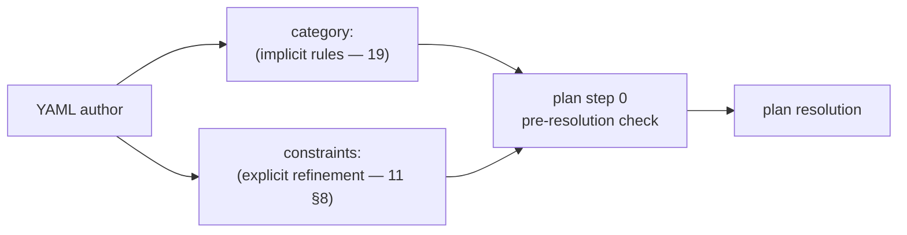
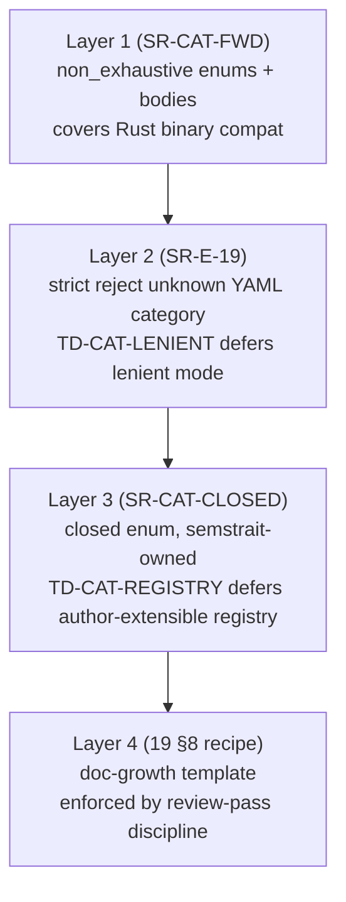
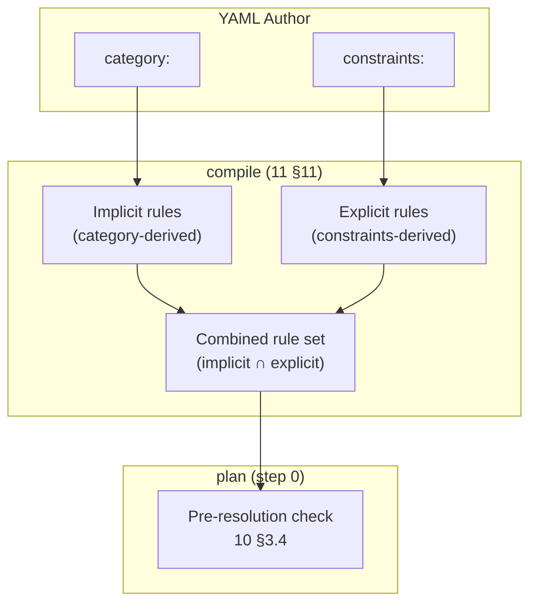

# 19. Categories — Dimension / Measure / Metric

`19` ratifies the **category axis** that classifies every `Dimension` / `Measure` / `Metric` by its **nature** — what kind of thing the entity is, independently of its `expr:` or `agg:` mechanics. Categories drive **implicit constraints** that the planner and adapter consume; explicit `constraints:` blocks (`11 §8`) refine on top. The pattern is dbt-MetricFlow-aligned, extended to every Semantics carrier the spec ratifies.

Struct ownership: the `DimensionType` enum and its body structs are ratified in [`18 §4.1`](./18_entities.md#41-dimensiontype-roster); `19 §2` does **not** redefine them — it owns the *category-axis semantics*. `MeasureCategory` and `MetricCategory` are new and are **canonically ratified here in `19 §3` and `19 §4`**; `18 §5` and `§6` consume them via `Measure.category:` / `Metric.category:` fields per the `amend-18` pass.

> **Reader's note.** Categories are the **single labeled invariant** that replaces fragile correlations between `agg:` / `additivity:` / `expr:` shape. An author writing `category: average` once does not also need to write `agg: avg` and `additivity: non` — those are *derived*. Authors who insist on spelling them out must keep them consistent with the category, or `validate.measure-category-mismatch` fires (SR-E-13).

## Table of Contents

1. [Purpose, Layering, and Expandability Invariants](#1-purpose-layering-and-expandability-invariants)
2. [Dimension Categories — `DimensionType`](#2-dimension-categories--dimensiontype)
3. [Measure Categories — `MeasureCategory`](#3-measure-categories--measurecategory)
4. [Metric Categories — `MetricCategory`](#4-metric-categories--metriccategory)
5. [Implicit vs Explicit Constraints — Contract](#5-implicit-vs-explicit-constraints--contract)
6. [Structural Rules (SR-E-13 … SR-E-19)](#6-structural-rules-sr-e-13--sr-e-19)
7. [YAML Grammar — `category:` Collapsed Wrapper](#7-yaml-grammar--category-collapsed-wrapper)
8. [Adding a New Category — Growth Recipe](#8-adding-a-new-category--growth-recipe)
9. [Cross-References](#9-cross-references)

---

## 1. Purpose, Layering, and Expandability Invariants

### 1.1 Why a category axis

Every Semantics carrier — Dimension, Measure, Metric — has a *nature* that determines:

- **Validation.** `agg ∈ {Sum, Count}` is admissible on an additive Measure but not on a distinct-count Measure. Today this rule is correlation-by-convention; a category makes it a labeled invariant.
- **Planner routing.** A `ratio` Metric materializes its numerator and denominator as separate `PlanNode::Aggregate` outputs and combines them in a `PlanNode::Project`. A `simple` Metric is a thin wrapper over one Measure. The planner needs to know which case applies *before* inspecting `expr:`.
- **Adapter emission.** A `distinct` Measure may need a per-engine `COUNT(DISTINCT ...)` rewrite or a `approx_distinct` fallback under a session flag. The adapter dispatches on category, not on `agg:` alone (since `count_distinct` could also appear under a custom Measure that does *not* want approximation).
- **Author-facing intent.** An author writing `category: snapshot` expresses the intent ("this is a stock balance, not a flow") in one place. Without categories, the same intent is implicit across `agg: sum` + `additivity: { semi: { axes: [date], strategy: latest } }`, which is fragile.

Categories collapse all four concerns into **one labeled axis** per carrier.

### 1.2 Three carriers, three category enums (not one unified `Category`)

The three category enums shape different things:

| Carrier | Category enum | What it shapes |
|---|---|---|
| `Dimension` | `DimensionType` (existing — `18 §4.1`) | Value extraction + group-by behavior — what the column *is*. |
| `Measure` | `MeasureCategory` (new — `19 §3`) | Aggregation legality — how the column *aggregates*. |
| `Metric` | `MetricCategory` (new — `19 §4`) | Derivation pattern — how the metric *composes*. |

A single unified `Category` would lose semantic precision. Every consumer (planner, adapter, validator) switches on the carrier first; collapsing the three would force a redundant cross-carrier dispatch on every consumer. The three enums share the *naming pattern* and the *implicit-constraints discipline* — but not the namespace.

### 1.3 Implicit-vs-explicit layering



- **Implicit constraints** are derived from the category. They are not authored as YAML — they live as code-side invariants the planner and adapter consume. A category change is the *only* way to change implicit constraints.
- **Explicit constraints** (`11 §8`) are authored as a `constraints:` block on the carrier. They refine the implicit defaults — typically by *narrowing* (e.g. "this Measure may only appear in queries grouped by `date`"). They cannot widen what the category locks.

The two together: categories say *what an entity is*; explicit constraints say *how a request may use it*. Both feed the planner's step-0 pre-resolution check. See `§5` for the full contract.

### 1.4 Expandability invariants

Categories are a **closed, spec-owned set** in v1. The roster mirrors `DimensionType`'s already-shipped pattern. The expansion mechanism operates at four layers, with the following invariants ratified here:

#### Layer 1 — Rust-level forward compatibility (`SR-CAT-FWD`)

Every category enum (`DimensionType`, `MeasureCategory`, `MetricCategory`) and every body struct (`DistinctMeasureBody`, `StatisticalMeasureBody`, `SnapshotMeasureBody`, `SimpleMetricBody`, `RatioMetricBody`, `DerivedMetricBody`, plus future bodies) carries `#[non_exhaustive]`. Every variant body that adds a field post-v1 uses `#[serde(default)]` so older manifests parsed against newer binaries succeed without erroring on the missing field. Every consumer-side `match` on a category uses **exhaustive arms** — never a wildcard `_ =>` no-op — and unknown variants returned by the parser flow through a `BugCheck::UnsupportedCategory(...)` arm so a new spec-side variant becomes a compile-time error in every consumer that has not yet learned about it.

This is the discipline equivalent of `00 §9 I10` applied specifically to categories. The same rule applies recursively to every nested enum (e.g. `StatisticalKind`, `SemiAdditivityStrategy` consumed by `SnapshotMeasureBody`).

#### Layer 2 — YAML strict reject (`SR-E-19 validate.unknown-category`)

When the binary encounters a `category:` value it does not recognize, validation fails with `validate.unknown-category` and a clear "spec version older than manifest — upgrade semstrait or downgrade the manifest" hint. v1 does **not** support lenient downgrade; that pathway is deferred under `[TD-CAT-LENIENT]` (treat unknown category as `Custom` + drop unknown body fields with a `plan.unknown-category-degraded` warning). Strict-then-loosen is the safe direction: a future major version may flip the default with a session flag once forward-read compatibility becomes a real demand.

#### Layer 3 — Closed-enum extensibility (`SR-CAT-CLOSED`)

Manifest authors **cannot** define their own categories. Adding a new category is a semstrait release with a doc update (per the §8 growth recipe), an enum bump, and a registry/adapter cascade — the same model as adding a `DimensionType` variant. The `Custom` escape hatch (only on `MeasureCategory`) stays anonymous (no `name:` field) and requires explicit `agg:` + `additivity:` declaration; it is *not* a registration mechanism.

A future author-extensibility model (registry-pattern, mirroring [`14a §2 FunctionRegistry`](./14a_function_catalog.md)) is deferred under `[TD-CAT-REGISTRY]`. Manifests would declare project-local categories via a `category_definitions:` block with an implicit-constraint DSL, agg/additivity derivation rules, and adapter-emission templates. Open question if author demand surfaces.

#### Layer 4 — Spec-doc growth recipe (`19 §8`)

Every new category authored into `19_categories.md` must fill a fixed-shape recipe (variant + body shape, implicit-constraint table row, planner routing notes, adapter emission strategy, SR-E-* additions, manifest YAML examples, peer-system lineage). A category that lands without all sections does not pass the `review-pass` discipline. This is doc-shape discipline, not enforced syntax — but the recipe lives at `§8` so it is unavoidable for any author drafting a new variant.



The four layers compose: Layer 1 keeps the binary stable across variant additions; Layer 2 keeps YAML strict so unknowns surface as diagnostics rather than silent acceptance; Layer 3 keeps the source of truth in the spec; Layer 4 keeps the spec growth disciplined. None of the four can be relaxed individually without the others; the deferred TDs (`[TD-CAT-LENIENT]`, `[TD-CAT-REGISTRY]`) describe coherent future loosenings of Layer 2 and Layer 3 respectively.

---

## 2. Dimension Categories — `DimensionType`

`DimensionType` is the **Dimension category axis**. Its enum roster and body struct shapes are ratified canonically in [`18 §4.1`](./18_entities.md#41-dimensiontype-roster). `19 §2` is the canonical home for the *category-axis semantics* of those variants — what each variant implies for planner routing, adapter behavior, and validation rules.

### 2.1 Roster (canonical home: `18 §4.1`)

```rust
// Pointer-only — see 18 §4.1 for the canonical definition.
#[non_exhaustive]
pub enum DimensionType {
    Temporal(TemporalDimensionBody),
    Categorical,
    Binary,
    Geo,
    Bucketed(BucketedDimensionBody),
    Metadata(MetadataDimensionBody),
}
```

Per `SR-CAT-FWD`, this enum and every body it carries are `#[non_exhaustive]`.

### 2.2 Implicit-constraint contract per Dimension category

| Category | What it locks (implicit) | Planner contract | Adapter contract |
|---|---|---|---|
| `Temporal(TemporalDimensionBody)` | `data_type ∈ {Date, Time, Timestamp}`; `body.grains` enumerates the rollup axes the source supports. | Eligible as Grainset rollup axis (`22 §4`), `TemporalShape` anchor (`17`), `DATE_TRUNC`-type expressions (`14a`). | Emits `DATE_TRUNC` per engine syntax (`registry/functions_mapping.md`); honors `body.grains` whitelist. |
| `Categorical` | None beyond default — open-ended grouping/filter axis. | Default `GROUP BY` candidate. | Pass-through. |
| `Binary` | Implies a two-valued axis (`Y`/`N`, true/false). `data_type:` typically `Boolean` or `String`. | Treated as a categorical of arity 2 for cardinality estimates. | May rewrite `'Y'` / `'N'` to `BOOLEAN` per adapter (`13 §4.4`). |
| `Geo` | Implies a geo-typed axis. v1 has no geo grain (see `13 §3.4 TD-GRAIN-NON-TEMPORAL`). | Treated as a categorical with high cardinality (no temporal rollup). | Pass-through; future geo functions (`14a`) emit per-engine spatial syntax. |
| `Bucketed(BucketedDimensionBody)` | `body.buckets` defines a closed `CASE WHEN` projection over an underlying numeric / temporal column resolved via `SemanticMapping` (`15`). The Dimension's own `data_type:` is typically `String` (the bucket label). | Compile materializes the `CASE` expression once; planner uses it as a categorical. | Emits the `CASE WHEN` SQL once per query. |
| `Metadata(MetadataDimensionBody)` | `body.source` declares where to extract the value (path token / partition column / S3 metadata field). | Resolved at compile-time scan emission (`15 §8`), not at query time. | Splices the metadata literal at scan-bind time. |

The above table is the v1 *implicit-constraint contract* for `DimensionType`. Authoring a `Dimension` whose declared `data_type:` violates the category's lock (e.g. `category: temporal` + `data_type: integer`) is `validate.dimension-category-data-type-mismatch` (SR-E-15).

### 2.3 Identifier — deferred

A proposed `Identifier` Dimension category — high-cardinality bare ID (foreign-key column exposed as a Dimension); planner avoids it as a default group-by; adapters may forbid it from `SELECT DISTINCT` constraints; distinguishes ID-like Dimensions from low-cardinality `Categorical` — was raised in the categories-and-constraints expansion pass and is **deferred** to [`questions/open/19_questions.md`](../questions/open/19_questions.md) as `Q-CAT-001`. v1 does not introduce the variant; authors who want this distinction either use `Categorical` (with a high-cardinality assumption) or attach `keys.foreign:` (`18 §9`) where the FK semantics are structural rather than queryable.

### 2.4 No new variants in v1

The five existing `DimensionType` variants ship unchanged. Sub-shape polish (post-v1: `CategoricalBody::enum_values`, `BinaryBody::binary_type ∈ {Boolean, Bit, String}`, `GeoBody::{lat, lon}`) is tracked at `[18 §4.1]`'s "Sub-shape polish" note.

---

## 3. Measure Categories — `MeasureCategory`

`MeasureCategory` is **canonically ratified here**. `Measure.category:` is added in [`18 §5`](./18_entities.md#5-measure) per the `amend-18` pass; every other consumer references this section.

### 3.1 Enum

```rust
/// Classifies a Measure by its *aggregation nature*.
///
/// A category derives the values of `agg` and `additivity` per the table in
/// §3.3. Authors may still spell those fields explicitly (must agree with the
/// category-implied values, else `validate.measure-category-mismatch` SR-E-13).
///
/// Non-exhaustive per `SR-CAT-FWD` (Layer 1 of §1.4).
#[non_exhaustive]
pub enum MeasureCategory {
    /// Pure additive: agg ∈ {Sum, Count}, additivity = Full implicit.
    /// Aligns with dbt's `sum` / `count` simple measure shapes and Cube's
    /// `sum` / `count` types.
    Additive,

    /// Min / max — idempotent under refinement (`MIN(MIN(x)) = MIN(x)`).
    /// Treated as additive for rollup purposes; agg ∈ {Min, Max}.
    MinMax,

    /// Average — non-additive mechanically. The planner re-aggregates from
    /// SUM/COUNT at the queried grain (`14a` lowering rule).
    Average,

    /// Distinct count over a named axis. Non-additive.
    /// agg = CountDistinct.
    Distinct(DistinctMeasureBody),

    /// Statistical aggregate (StdDev / Variance / Median / Percentile).
    /// Non-additive — recompute at the queried grain.
    Statistical(StatisticalMeasureBody),

    /// Boolean count — sum of a boolean projection (true → 1, false → 0).
    /// Equivalent to dbt's `sum_boolean` simple-measure shape.
    /// agg = Sum applied to a CASE WHEN <expr> THEN 1 ELSE 0 END projection.
    Boolean,

    /// Snapshot / semi-additive — additive across some axes, non-additive
    /// across others (typically time). Replaces explicit
    /// `additivity: { semi: { ... } }` authoring; the body carries the
    /// non-additive axes and the rollup strategy.
    Snapshot(SnapshotMeasureBody),

    /// Escape hatch — author states `agg:` + `additivity:` manually. The
    /// category provides no implicit lock; the validator runs only
    /// agg-vs-additivity coherence checks (`14a`'s aggregation lattice).
    /// Exists for v1 cases the closed roster does not yet cover; new
    /// stable patterns should land as named variants per §8 instead.
    Custom,
}
```

Companion bodies — every body is `#[non_exhaustive]` per `SR-CAT-FWD`:

```rust
#[non_exhaustive]
pub struct DistinctMeasureBody {
    /// The Semantic name (Dimension or expression alias) over which to
    /// count distinct values. Resolved at compile-time via the carrier's
    /// owning interface (`11 §11`).
    pub dimension: SemanticsName,
}

#[non_exhaustive]
pub struct StatisticalMeasureBody {
    pub kind: StatisticalKind,
}

#[non_exhaustive]
#[serde(rename_all = "snake_case")]
pub enum StatisticalKind {
    StdDev,
    Variance,
    Median,
    Percentile(PercentileBody),
}

#[non_exhaustive]
pub struct PercentileBody {
    /// Percentile target in [0.0, 1.0] (e.g. 0.95 for p95).
    pub value: f64,
}

#[non_exhaustive]
pub struct SnapshotMeasureBody {
    /// Dimension axes along which the Measure is non-additive (typically
    /// the temporal axis for stock balances). Synthesised into
    /// `AdditivityType::Semi(SemiAdditivity { axes, strategy })` per §3.3.
    pub non_additive_axes: Vec<SemanticsName>,

    /// Rollup strategy for the non-additive axes — reuses the existing
    /// `SemiAdditivityStrategy` from `18 §5.2` (`Latest` / `Earliest` /
    /// `Average` / `First` / `Last`).
    pub strategy: SemiAdditivityStrategy,
}
```

`SnapshotMeasureBody` reuses `SemiAdditivityStrategy` from [`18 §5.2`](./18_entities.md#52-additivitytype-roster); no new strategy enum is introduced.

### 3.2 Per-category bodies — design notes

- **Bodies carry only what the category implies.** `Distinct.dimension` is required because a distinct count without a target column is meaningless. `Snapshot.non_additive_axes` + `Snapshot.strategy` are required because the planner needs them to lower semi-additive rollups. `Statistical.kind ∈ {StdDev, Variance, Median, Percentile}` is required because the four shapes lower differently per engine.
- **Bodies are `#[non_exhaustive]`.** Per `SR-CAT-FWD`, future fields (e.g. `Distinct.body.approximate: bool` for `approx_distinct` opt-in) can land as MINOR with `#[serde(default)]`.
- **Body-less variants are deliberate.** `Additive`, `MinMax`, `Average`, `Boolean`, `Custom` carry no body because their implicit-constraint contract is fully expressible from `agg:` + `additivity:` defaults alone. Adding a body to one of them later is MINOR if the field has a sensible default.

### 3.3 Implicit-constraint contract per Measure category

| Category | Implies `agg:` | Implies `additivity:` | Body required? | Notes / planner contract |
|---|---|---|---|---|
| `Additive` | `Sum` or `Count` (author picks) | `Full` | No | Default routing — emit `SUM(...)` / `COUNT(...)` at the queried grain. |
| `MinMax` | `Min` or `Max` (author picks) | `Full` (idempotent under refinement) | No | Treated as additive for rollup; `MIN(MIN(x)) = MIN(x)`. |
| `Average` | `Avg` | `Non` | No | Planner materializes `SUM(x)/COUNT(x)` at queried grain (`14a` lowering). |
| `Distinct(DistinctMeasureBody)` | `CountDistinct` | `Non` | Yes — `body.dimension` | Adapter emits `COUNT(DISTINCT body.dimension)`; per-engine `approx_distinct` rewrite tier per `registry/functions_mapping.md`. |
| `Statistical(StatisticalMeasureBody)` | per `body.kind`: `StdDev` → `StdDev`; `Variance` → `Variance`; `Median` → `Median`; `Percentile` → `Median` (placeholder until `14a` adds a percentile aggregator) | `Non` | Yes — `body.kind` | Recomputed at queried grain; never rolled up mechanically. |
| `Boolean` | `Sum` (over `CASE WHEN expr THEN 1 ELSE 0 END`) | `Full` | No | Planner wraps `expr:` (or the bound Semantic) in a `CASE` projection at compile. |
| `Snapshot(SnapshotMeasureBody)` | `Sum` / `Min` / `Max` / `First` / `Last` (author picks; default `Sum` for stock-style aggregates) | `Semi(SemiAdditivity { axes: body.non_additive_axes, strategy: body.strategy })` — synthesized | Yes — `body.non_additive_axes`, `body.strategy` | Replaces explicit `additivity: { semi: { axes, strategy } }` authoring. Per the ratification in this pass, `category: snapshot` is the **preferred authoring path**; explicit `additivity: semi` remains valid but is discouraged. Both produce the same `AdditivityType::Semi(SemiAdditivity)` value at the planner layer (`18 §5.2`). |
| `Custom` | author-stated (required) | author-stated (required) | No | Validator runs only the agg-vs-additivity coherence check (`14a`); no category-implied lock. Used for v1 patterns the closed roster does not yet cover. |

A `category:` declaration **derives** the values of `agg:` and `additivity:`. Authors may still spell them out explicitly (must agree with the category-implied values, else SR-E-13 fires). The motivation for keeping the explicit spelling legal: backward compatibility with pre-`19` manifests during the migration window (tracked under `[TD-CATEGORIES-MIGRATE]`).

### 3.4 Authoring example

```yaml
measures:
  # Additive — derived agg + additivity. No body needed.
  - name: gross_revenue
    data_type: decimal(18, 2)
    category: additive
    agg: sum                            # optional — derives anyway
    expr: amount_cents * 0.01

  # Average — agg = avg, additivity = non implicit.
  - name: avg_basket_size
    data_type: double
    category: average
    expr: basket_total

  # Distinct — body carries the dimension to count.
  - name: unique_customers
    data_type: long
    category:
      distinct:
        dimension: customer_id

  # Statistical percentile.
  - name: p95_response_ms
    data_type: double
    category:
      statistical:
        kind:
          percentile:
            value: 0.95

  # Snapshot — body carries non_additive_axes + strategy.
  # Replaces the legacy `additivity: { semi: { axes, strategy } }` shape.
  - name: inventory_on_hand
    data_type: long
    category:
      snapshot:
        non_additive_axes: [snapshotted_at]
        strategy: latest
    agg: sum                            # author may state; must agree

  # Boolean count.
  - name: orders_with_discount
    data_type: long
    category: boolean
    expr: discount_amount > 0

  # Custom escape hatch — must spell out agg + additivity.
  - name: weighted_revenue_proxy
    data_type: decimal(18, 2)
    category: custom
    agg: sum
    additivity: full
    expr: amount_cents * weight * 0.01
```

### 3.5 Peer-system lineage

| Variant | dbt MetricFlow | Cube | LookML | Notes |
|---|---|---|---|---|
| `Additive` | `simple` measure with `agg ∈ {sum, count}` | `sum` / `count` | `sum` / `count` measure types | Trivially aligned. |
| `MinMax` | `simple` with `agg ∈ {min, max}` | `min` / `max` | `min` / `max` measure types | Same. |
| `Average` | `simple` with `agg = avg` | `avg` | `avg` | dbt computes `sum/count` at query time; same lowering. |
| `Distinct` | `simple` with `agg = count_distinct` (+ optional `approx`) | `count_distinct` / `count_distinct_approx` | `count_distinct` measure type | `body.dimension` matches dbt's `agg_params.expr`. |
| `Statistical` | n/a in dbt; engine-side aggregates | `stddev` / `var` / `median` etc. | `median` / `percentile` measure types | Lifted from the SQL standard aggregate set. |
| `Boolean` | `simple` with the `sum_boolean` agg (dbt-specific) | `count_distinct` over filtered set; no direct equivalent | `count` w/ filter | Dbt's pattern is the closest match. |
| `Snapshot` | dbt does not surface semi-additive directly; Cube has `running_total` | Cube `rolling_window` / Kimball semi-additive | LookML `period_over_period` filters | Closest peer is Kimball semi-additive vocabulary, not any single semantic-layer system. |
| `Custom` | dbt `derived` (post-v1) | Cube `multi_stage` / `time_shift` | LookML `derived_table` | Escape hatch; not a peer-system one-to-one. |

### 3.6 Reserved / post-v1 Measure categories

Future Measure categories (not in v1; ratified additions land per §8):

- **`Cumulative`** — running totals over a window (`SUM(...)` over an `OVER` clause). Cross-cuts `00 §10`'s window-function deferral; not authoring-legal in v1.
- **`Conversion`** — funnel-conversion measure (e.g. "fraction of leads that converted within 30 days"). Cross-cuts `00 §10`'s conversion-metric deferral.

Both reside in `MetricCategory` as commented-out reserved variants per `§4.1`, **not** here — the funnel/cumulative pattern in dbt MetricFlow is metric-shaped, not measure-shaped. If a future Measure-shaped variant of either lands, it must justify why it cannot be expressed as a `MetricCategory::Cumulative` or `MetricCategory::Conversion` first.

---

## 4. Metric Categories — `MetricCategory`

`MetricCategory` is **canonically ratified here**. `Metric.category:` is added in [`18 §6`](./18_entities.md#6-metric) per the `amend-18` pass.

### 4.1 Enum

```rust
/// Classifies a Metric by its *derivation pattern*.
///
/// v1 roster is `{Simple, Ratio, Derived}`. `Cumulative` and `Conversion` are
/// reserved variants documented but commented out — `00 §10` defers them.
/// Their commented presence here is a doc-shape hint for future authors;
/// the comments may be removed if confusing — they do not affect Rust syntax
/// because the variants themselves are commented out.
///
/// Non-exhaustive per `SR-CAT-FWD`.
#[non_exhaustive]
pub enum MetricCategory {
    /// Wraps a single Measure with optional filter. The Metric's
    /// additivity follows the wrapped Measure's additivity.
    Simple(SimpleMetricBody),

    /// Numerator / denominator over Measures or Simple metrics.
    /// additivity = Non (ratios are not mechanically rollupable).
    Ratio(RatioMetricBody),

    /// Algebraic combination of multiple Measures / Metrics.
    /// additivity author-stated; default Non for safety.
    Derived(DerivedMetricBody),

    /// Reserved — running total / window aggregation. POST-V1 (`00 §10`
    /// defers window functions).
    // Cumulative(CumulativeMetricBody),

    /// Reserved — conversion-funnel metric. POST-V1 (`00 §10` defers
    /// conversion metrics).
    // Conversion(ConversionMetricBody),
}
```

Companion bodies:

```rust
#[non_exhaustive]
pub struct SimpleMetricBody {
    /// The wrapped Measure name. Resolved against the carrier's owning
    /// interface (`11 §11`).
    pub measure: SemanticsName,

    /// Optional filter applied to the wrapped Measure — equivalent to
    /// authoring an `AggregationFilter` on the underlying Measure
    /// (`18 §7.2`), but locally scoped to this Metric's projection.
    #[serde(default, skip_serializing_if = "Option::is_none")]
    pub filter: Option<crate::expr_block::ExprSource>,
}

#[non_exhaustive]
pub struct RatioMetricBody {
    /// Numerator — Measure or Simple-Metric name.
    pub numerator: SemanticsName,

    /// Denominator — Measure or Simple-Metric name. Division-by-zero is
    /// adapter-emitted as `NULLIF(denominator, 0)` per `registry/functions_mapping.md`.
    pub denominator: SemanticsName,

    /// Optional filter applied to both numerator and denominator.
    #[serde(default, skip_serializing_if = "Option::is_none")]
    pub filter: Option<crate::expr_block::ExprSource>,
}

#[non_exhaustive]
pub struct DerivedMetricBody {
    /// The combining expression — references ≥ 2 Measures / Metrics.
    /// At least one Measure / Metric reference is required (else the
    /// "Metric" is effectively a Simple).
    pub expr: crate::expr_block::ExprSource,
}
```

### 4.2 Implicit-constraint contract per Metric category

| Category | `expr:` shape lock | Implies `additivity:` | Body required? | Planner contract |
|---|---|---|---|---|
| `Simple(SimpleMetricBody)` | `expr:` resolves to a single Measure name (or omitted; `body.measure` is the source of truth). | Inherits the wrapped Measure's `additivity:`. | Yes — `body.measure` | Lowers to a thin projection over the wrapped Measure's aggregate. |
| `Ratio(RatioMetricBody)` | `expr:` shape is `numerator / denominator`; both sides MUST be Measure or Simple-Metric names; no ad-hoc operators. | `Non` (ratios are not mechanically rollupable). | Yes — `body.numerator`, `body.denominator` | Materializes both Measures at queried grain; combines in a `PlanNode::Project` post-aggregate. |
| `Derived(DerivedMetricBody)` | `expr:` references ≥ 2 Measures / Metrics; arbitrary `14a` function calls allowed. | Author-stated (default `Non` for safety since most algebraic combinations are non-additive). | Yes — `body.expr` | Lowers to a projection over the referenced Measures' aggregates. |

A Metric that fails the category's expr-shape lock — e.g. `category: ratio` with `body.numerator: revenue + tax` — is `validate.metric-category-expr-shape-mismatch` (SR-E-17).

### 4.3 Authoring example

```yaml
metrics:
  # Simple — wraps `gross_revenue` with no filter.
  - name: revenue
    data_type: decimal(18, 2)
    category:
      simple:
        measure: gross_revenue

  # Simple — wraps `gross_revenue` with a filter.
  - name: revenue_usd_only
    data_type: decimal(18, 2)
    category:
      simple:
        measure: gross_revenue
        filter: currency == 'USD'

  # Ratio — `cpc = cost / clicks`; additivity = Non implicit.
  - name: cpc
    data_type: double
    category:
      ratio:
        numerator: cost
        denominator: clicks

  # Derived — algebraic combination over two Measures.
  - name: revenue_plus_shipping
    data_type: decimal(18, 2)
    category:
      derived:
        expr: gross_revenue + shipping_revenue
    additivity: full                     # author-stated; algebraic linear combo is additive
```

### 4.4 Peer-system lineage

| Variant | dbt MetricFlow | Cube | LookML | Notes |
|---|---|---|---|---|
| `Simple` | `simple` metric | `count` / `sum` measures (Cube collapses Measure / Metric) | LookML measure | dbt's `simple` metric is one-to-one. |
| `Ratio` | `ratio` metric | n/a directly; expressed as derived | n/a directly | dbt's `ratio` is one-to-one. |
| `Derived` | `derived` metric | `cube.measures.*` derived | LookML measure with `expression:` | dbt's `derived` shape is the broadest peer match. |
| `Cumulative` (post-v1) | `cumulative` | `rolling_window` | LookML windowed measure | Reserved per §4.1; lands when `00 §10` window-function deferral lifts. |
| `Conversion` (post-v1) | `conversion` | n/a | n/a | Reserved per §4.1; lands when `00 §10` conversion-metric deferral lifts. |

### 4.5 Reserved / post-v1 Metric categories

`Cumulative` and `Conversion` are listed as commented-out reserved variants in `§4.1`'s enum source. Their full body shapes — `CumulativeMetricBody` (window expression, partition keys, frame), `ConversionMetricBody` (funnel events, time horizon) — are post-v1 per `00 §10` and will land in `19_categories.md` when ratified, following the §8 growth recipe.

---

## 5. Implicit vs Explicit Constraints — Contract

### 5.1 Implicit constraints come from the category

For every realized carrier (`Dimension`, `Measure`, `Metric`), the category's row in §2.2 / §3.3 / §4.2 declares the implicit-constraint contract: which fields are derived, which are locked to a specific value, which require a body, which are simply consulted by the planner / adapter at the appropriate stage.

Implicit constraints do **not** appear in YAML. An author writing `category: average` is implicitly stating `agg: avg` + `additivity: non`. The same author writing `agg: sum` + `additivity: full` would trigger `validate.measure-category-mismatch` (SR-E-13).

### 5.2 Explicit constraints (`11 §8`) refine on top

After the implicit constraints are established, the explicit `constraints:` block (`11 §8`) refines them. v1 realized refinements are the two kind sub-blocks ratified in `11 §8.4`:

- `dimensions: { one_of, none_of, all_of }` — narrows the request's query scope.
- `aggregation: { allowed, prohibited }` — restricts how the Measure / Metric may be re-aggregated downstream by a parent query.

Explicit constraints can only **narrow** what the category permits — they cannot widen. For example:

- A `category: distinct` Measure has implicit `agg: count_distinct`. An explicit `constraints.aggregation.allowed: [sum]` is `validate.constraints-incompatible-with-category` (SR-E-15) — it tries to widen what the category locks.
- A `category: additive` Measure has implicit `agg ∈ {Sum, Count}` and `additivity: full`. An explicit `constraints.aggregation.prohibited: [count]` is legal — it narrows the implicit set from `{Sum, Count}` to `{Sum}`.

The narrowing-only rule is enforced at validation time via SR-E-15.

### 5.3 The combined picture



The planner's step-0 pre-resolution check consumes the *combined* rule set — there is no two-stage check (implicit first, explicit second). This matches today's `ConstraintValidator::check()` entry point in `11 §8.6`; the lift to a category-aware combined check is part of the `[TD-CATEGORIES-MIGRATE]` code-side migration.

### 5.4 Carriers in v1

Per the Q-R4.3d ratification (`11 §8` rewrite — see `rewrite-11-8`), the v1 explicit-constraint carriers are **`Measure` and `Metric`**. `Filter` does not carry `constraints:` in v1 (`SR-E-18`). Reserved future carriers (`Dimension`, `Key`, `DataKind`) are folded into a single `[TD-CONSTRAINT-CARRIER-EXT]` note in `11 §8`.

Categories, by contrast, apply to all three Semantics carriers (Dimension, Measure, Metric). The asymmetry is deliberate — categories classify *what an entity is*; explicit constraints refine *how a request may use it*. Carriers needing only the former (Dimension) get categories without explicit constraints; carriers needing both (Measure, Metric) get both.

---

## 6. Structural Rules (SR-E-13 … SR-E-19)

Entity-level invariants for the category axis. Numbered in continuation of `18 §11`'s SR-E-* roster (which ends at SR-E-12). Per the `amend-18` pass, these rows are appended to the SR-E-* table in [`18 §11`](./18_entities.md#11-structural-rules-sr-e-).

| ID | Rule | Diagnostic | Stage |
|---|---|---|---|
| **SR-E-13** | `Measure.category:` and `Metric.category:` derived `agg:` / `additivity:` MUST agree with author-stated `agg:` / `additivity:` (when present). | `validate.measure-category-mismatch` / `validate.metric-category-mismatch` | `validate` |
| **SR-E-14** | A category whose body is non-empty MUST author every required body field. | `validate.category-body-incomplete` | `validate` |
| **SR-E-15** | A `constraints:` block MAY NOT widen what the category locks. Examples: `aggregation.allowed:` listing an aggregation outside the category-implied set; `dim_type` overrides on a Dimension `Ref` site. | `validate.constraints-incompatible-with-category` (Measure / Metric) / `validate.dimension-category-data-type-mismatch` (Dimension) | `validate` |
| **SR-E-16** | Downstream re-aggregation of a Measure / Metric MUST satisfy the carrier's `aggregation:` constraint (implicit ∩ explicit) — e.g. wrapping a `category: ratio` Metric in a `SUM(...)` is rejected because `Ratio` implicit-locks `additivity: non`. | `plan.downstream-aggregation-violation` | `plan` (step 0) |
| **SR-E-17** | A `Metric.category:` shape MUST match the Metric's `expr:` shape — a `category: ratio` Metric whose `body.numerator:` resolves to a non-Measure / non-Simple-Metric name is rejected. | `validate.metric-category-expr-shape-mismatch` | `validate` |
| **SR-E-18** | A `Filter` entity MUST NOT carry a top-level `constraints:` field (see Q-R4.3d in `11 §8` rewrite — Filter is dropped from the carrier list in v1). | `validate.constraints-on-filter-entity` | `validate` |
| **SR-E-19** | An unrecognized `category:` value (not in the spec-owned roster) is rejected; the diagnostic includes a "spec version older than manifest" hint. v1 does not lenient-downgrade unknown categories — see `[TD-CAT-LENIENT]`. | `validate.unknown-category` | `validate` |

Per the `SR-CAT-FWD` invariant (`§1.4 Layer 1`), every code path that consumes one of these SR-E-* codes uses an exhaustive match on the category — never a wildcard.

---

## 7. YAML Grammar — `category:` Collapsed Wrapper

`category:` follows the same collapsed-wrapper convention as `extras.temporal:` (see [`18 §3.2`](./18_entities.md#32-yaml-shape--collapsed-wrapper)).

### 7.1 Body-less variants

Variants with no body use the bare lowercase name as a YAML scalar:

```yaml
- name: gross_revenue
  category: additive       # bare scalar → MeasureCategory::Additive

- name: avg_basket_size
  category: average        # bare scalar → MeasureCategory::Average

- name: orders_with_discount
  category: boolean        # bare scalar → MeasureCategory::Boolean

- name: country
  type: categorical        # Dimension uses `type:` not `category:` —
                           # historical shape preserved per 18 §4.2.
```

### 7.2 Variants with bodies

Variants with bodies use a single-key map under `category:`:

```yaml
- name: unique_customers
  category:
    distinct:
      dimension: customer_id

- name: inventory_on_hand
  category:
    snapshot:
      non_additive_axes: [snapshotted_at]
      strategy: latest

- name: cpc
  category:
    ratio:
      numerator: cost
      denominator: clicks

- name: p95_response_ms
  category:
    statistical:
      kind:
        percentile:
          value: 0.95
```

Multiple keys under a single `category:` mapping = `parse.category-multiple-variants` (analogous to `parse.temporal-multiple-variants` in `18 §3.2`).

### 7.3 Dimension's `type:` retains its historical name

`Dimension` continues to author its category under `type:` (per `18 §4.2`'s YAML shape — established before this pass). The field name is **not** renamed to `category:` in v1 to avoid cascading manifest churn. Internally, `dim_type: DimensionType` IS the Dimension category axis; the YAML key is the only difference. A future MAJOR version may unify the spelling under `category:` if author demand surfaces — tracked as a doc-shape note in `00 §4`'s glossary, not a TD.

### 7.4 Compatibility with explicit `agg:` / `additivity:`

A Measure / Metric authored with `category:` MAY also state `agg:` and / or `additivity:` explicitly. The values must agree with the category-implied derivations (SR-E-13). The motivation: backward compatibility with pre-`19` manifests during the `[TD-CATEGORIES-MIGRATE]` migration window. Once the migration completes, explicit `agg:` / `additivity:` on a category-stated Measure / Metric becomes a `parse.category-redundant-agg-additivity` warning (not error), and authors are encouraged to remove the redundant fields.

---

## 8. Adding a New Category — Growth Recipe

Every new category authored into `19_categories.md` (whether `DimensionType`, `MeasureCategory`, `MetricCategory`, or a future fourth carrier) MUST fill the following recipe. A category that lands without all sections does not pass the `review-pass` discipline in the spec-driven-dev mode.

The recipe is the canonical home of the `SR-CAT-FWD` Layer 4 invariant (§1.4): *spec-doc growth is disciplined, not arbitrary*.

### Recipe sections (in order)

1. **Variant declaration** — Rust-level enum row, body struct (if any), and a one-sentence rationale ("what is this category, and why is it not expressible by an existing variant?"). Body struct must be `#[non_exhaustive]` per `SR-CAT-FWD`. Post-v1 fields use `#[serde(default)]`.

2. **Implicit-constraint table row** — append to the relevant table in `§2.2` / `§3.3` / `§4.2`:
   - what `agg:` / `additivity:` / `data_type:` / `expr-shape:` is implied,
   - whether a body is required,
   - one-sentence planner contract,
   - one-sentence adapter contract.

3. **Planner routing notes** — what planner sub-step consumes the new category, what `PlanNode` shape it lowers to, what advisory warnings (if any) it emits. This is a forward-reference into `34` and the per-variant `21`–`24` strategy docs.

4. **Adapter emission strategy** — per-engine syntax notes; cross-reference to the relevant `registry/*.md` catalog. If the new category requires a new canonical function (`14a`), the function must land in `14a` first or in the same pass.

5. **SR-E-* additions** — any new validation rule the category requires. Numbered in continuation of the SR-E-13 … SR-E-19 roster ratified here. Must list the diagnostic kebab-case code per `30 §6`.

6. **Manifest YAML examples** — at least one body-less example (if applicable) and one body-bearing example. Examples must be self-contained (no forward references to undefined Semantics).

7. **Peer-system lineage** — a row in the relevant peer-system table (`§3.5` / `§4.4`). If the category has no peer in dbt / Cube / LookML, state so explicitly with a one-sentence justification (the deferral risk is "we are inventing a category that may not generalize").

8. **TD entries** — if the new category defers any sub-axis (e.g. an approximate-mode flag, a partition variant), add the TD to the deferred-extensibility roster in `§1.4` and to the front-matter `authoritative-for:` line of this doc.

A `review-pass` reviewer checks each of the eight sections is present and non-trivially populated. A category that passes `review-pass` is then ratified by a STATUS.md §2 reconciliation entry.

### Worked example — applying the recipe to `Cumulative`

When `Cumulative` (currently a commented-out reserved variant in `§4.1`) lands post-v1, the recipe pass would:

1. Declare `Cumulative(CumulativeMetricBody)` with `body: { window_expr, partition_keys, frame }`.
2. Add a row to `§4.2`: `expr-shape: SUM(...) OVER (...)`; implicit `additivity: non`; body required; planner lowers to `PlanNode::WindowAgg`; adapter emits `SUM(...) OVER (...)` with per-engine frame syntax.
3. Forward-reference `34 §...` for the `WindowAgg` planner step.
4. Cross-ref `registry/functions_mapping.md` for per-engine OVER-clause syntax; flag DataFusion / Spark / DuckDB coverage.
5. Add `SR-E-20 cumulative-frame-malformed` if the body's frame field has structural validation rules.
6. YAML examples: a `running_total_revenue` Cumulative metric with daily window.
7. Peer-system row: dbt `cumulative` direct match, Cube `rolling_window` partial match.
8. Drop the corresponding TD entry from §1.4's deferred-extensibility roster (or leave a marker that the variant has shipped).

---

## 9. Cross-References

- [`18 §4.1`](./18_entities.md#41-dimensiontype-roster) — `DimensionType` enum + body structs (canonical home; consumed by `§2`).
- [`18 §5`](./18_entities.md#5-measure) / [`§6`](./18_entities.md#6-metric) — `Measure.category:` / `Metric.category:` field declarations (added per `amend-18`).
- [`18 §11`](./18_entities.md#11-structural-rules-sr-e-) — SR-E-* table; SR-E-13 … SR-E-19 are appended per the `amend-18` pass.
- [`11 §8`](./11_names_and_scopes.md#8-constraint) — the `Constraint` framework; v1 explicit carriers reduced to `{Measure, Metric}` per the `rewrite-11-8` pass.
- [`13 §3`](./13_types_and_grain.md#3-grain) — `Grain` enum (consumed by `Temporal` Dimension category).
- [`13 §4`](./13_types_and_grain.md#4-dimensiontype-discriminator) — pointer note that `DimensionType` IS the Dimension category axis (added per `cascade-light`).
- [`14a`](./14a_function_catalog.md) — function catalog; categories drive which canonical functions an adapter emits.
- [`25`](../data-kinds/25_applicability_matrix.md) — applicability matrix; the "Category cross-cuts" column is added per `cascade-light`.
- [`32 §1`](../apis/32_semstrait_model.md) — root YAML examples showing `category:` on sample Measures / Metrics (updated per `cascade-light`).
- [`questions/open/19_questions.md`](../questions/open/19_questions.md) — deferred items: Q-CAT-001 (`Identifier` Dimension category), post-v1 Cumulative / Conversion bodies, registry-pattern extensibility (`[TD-CAT-REGISTRY]`), lenient-unknown-category mode (`[TD-CAT-LENIENT]`).
- [`docs/TECH_DEBT.md`](../../TECH_DEBT.md) (legacy) — `[TD-CATEGORIES-MIGRATE]` to be added when the implementation pass lands.
