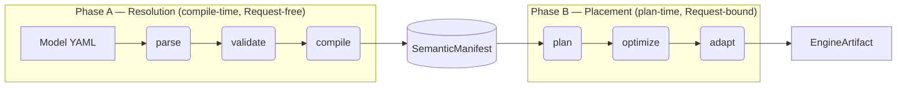

# 19. Expression Flow

> **Code samples in this document are illustrative.** Exact field names, method signatures, and the choice of enum-vs-struct shape may be refined during implementation. The spec asserts the architectural design (two type-system-distinct forms, conversion direction, substep ordering, placement contracts), not the precise Rust spelling.

## 1. Purpose and Scope

`19` ratifies the **flow** of expressions through `semstrait` — from authored YAML through compile-time resolution, through plan-time placement, to the canonical engine-portable form an adapter consumes. `14` ratifies the bare expression model (AST, wrappers, YAML authoring surface); `14a` ratifies function identity; `14b` ratifies the resolution algorithm. `19` layers on top:

Ratified surfaces are listed in this file's `authoritative-for` front matter. This chapter specifies their interaction boundaries (`resolve` substeps, shape gates, and Phase-B placement) without redefining upstream owner docs.

**What `19` does NOT ratify** (forward-refs):

- The bare `Expr` AST variant taxonomy, YAML grammar, identifier resolution per parse site — `14`.
- Canonical function identity, `FunctionRegistry`, `FnSignature` polymorphism — `14a`.
- `ResolvedExprTable`, cross-DataKind path resolution, cycle detection algorithm — `14b`.
- `Binding` / `SemanticMapping` construction — `15`.
- Cross-DataKind advisory specialisation roots (e.g. Unionset's `MissingMetadataDisjointnessProof`) — owning chapter (`23`).
- The `Strategy` algorithm bodies that consume `PhysicalExpr` — `34`.
- Engine-specific function and operator rewrites — `36`, `registry/functions_mapping.md`.

**Key invariants from earlier docs that `19` upholds:**

- **I1 / I2 / I3** (`00 §9`) — canonical layers carry no raw SQL, physical types, or engine branching; `PhysicalExpr` is engine-neutral.
- **I5** (`00 §9`) — name resolution at compile time only; `Parameter` placeholders carry typed-key identity, never engine literals.
- **I12** (`00 §9`) — typed diagnostics by stage; numeric codes serve as spec-cross-reference indices, never as canonical runtime data.

## 2. Two-Phase Pipeline

Slices the canonical pipeline (`00 §5`) into the two expression-relevant phases. Phase A spans `parse → validate → compile`; Phase B spans `plan → optimize → adapt`. The `SemanticManifest` carries `PhysicalExpr` (modulo `Parameter`) across the phase boundary.



Phase A is **compile-time, synchronous, Request-free**: `SemanticExpr::resolve` runs inside `compile`, consumes authored `SemanticExpr`, and emits `PhysicalExpr` carrying `Parameter(...)` leaves wherever a value must defer to the `Request`. The resulting `PhysicalExpr` is persisted in the `SemanticManifest`. Phase B is **plan-time, Request-bound**: `Strategy` (`34 §<Strategy>`) runs inside `plan`, binds `Parameter` leaves against the `Request`, lifts `Aggregate` nodes into `PlanNode::Aggregate`, and places the residual `PhysicalExpr` into the plan tree. The `plan → optimize → adapt` hot path is synchronous and free of hidden I/O per `00 §5`.

### 2.1 Phase A — Resolution

A single public entry point converts `SemanticExpr` to `PhysicalExpr`:

```rust
pub fn resolve(self, ctx: &LoweringCtx) -> Result<PhysicalExpr, CompileError>;
```

Phase A is **compile-time**, **synchronous**, **Request-free**, and **per-`Binding`** — every `(Semantics, Binding)` pair resolves once. The output `PhysicalExpr` is fully resolved **modulo `Parameter` placeholders** (§3.4); the original `14b §1` "fully resolved" wording softens accordingly.

### 2.2 Internal substep order

`resolve` is one public method; its three substeps are internal:

1. **Eliminate `Access` nodes** (Family B sugar). Expand entity-derived expressions (e.g. `measure.previous`) into canonical `Window` shapes parameterised by `Parameter::RequestDimensionsMinusTemporal` / `RequestTemporalAxis`. Runs to **fixpoint** so sugar-on-sugar shapes (e.g. `Delta` lowering to `op - op.Previous`) collapse fully before the next substep.
2. **Fold + partial-eval** (Family A sugar). Substitute metadata `EntityRef` to its `Binding`-resolved `Literal`; collapse foldable subtrees per the §5.1 fold language. Operates on `SemanticExpr` so collapsed branches never reach `PhysicalExpr` construction.
3. **Translate** surviving operands to `PhysicalExpr`. `EntityRef` becomes `Column` or a `Literal` (the latter only when Phase A already substituted it). Structural variants (`BinaryOp`, `Case`, etc.) and `Aggregate` walk with operand recursion.

The order is load-bearing: metadata-driven branch elimination (Family A) collapses per-Binding subtrees *before* any `PhysicalExpr` is constructed, so the resulting per-Binding plans diverge as expected (§5.3 worked example).

### 2.3 Phase B — Placement

The planner's `Strategy` consumes `PhysicalExpr` and produces a `PlanNode` tree (`34 §<Strategy>`). Phase B does two things `19` does not:

- **`Aggregate` lift.** `Aggregate` nodes in `PhysicalExpr` are extracted into `PlanNode::Aggregate` slots; the residual `PhysicalExpr` substitutes column refs to the lifted slots (§6).
- **`Parameter` binding.** Compile-emitted `Parameter` leaves are substituted with concrete values from the `Request` (§3.4).

A `Parameter` reaching the adapter is a hard error per `34 §<Strategy>` postcondition.

## 3. Type Architecture

`SemanticExpr` and `PhysicalExpr` are two **distinct enums** linked by a shared `Expr` trait. Type-level separation prevents pattern-matching a `Column` against a Semantic context or an `EntityRef` against a Physical context at construction.

> **Scoped extension.** This supersedes `14 §2`'s newtype-wrapper shape (`pub struct SemanticExpr(Expr)`) for the canonical form. `14`'s authoring-site semantics (which `expr:` lives in which wrapper) remain unchanged; only the underlying type-architectural form is refined here.

### 3.1 Trait surface

```rust
pub trait Expr: Sized {
    fn children(&self) -> Box<dyn Iterator<Item = &Self> + '_>;
    fn with_new_children(self, new_children: Vec<Self>) -> Result<Self, ValidateError>;
    fn inferred_type(&self) -> Option<&DataType>;

    fn apply<V: Visitor<Self>>(&self, v: &mut V) -> V::Output { /* default */ }
    fn transform<F>(self, f: F) -> Result<Self, CompileError>
    where F: FnMut(Self) -> Result<Self, CompileError> { /* default */ }
}

pub trait Foldable: Expr {
    fn fold(self, ctx: &FoldCtx) -> Result<Self, CompileError>;
}

pub trait Sugarful: Expr {
    fn eliminate_sugar(self, ctx: &LoweringCtx) -> Result<Self, CompileError>;
}

pub trait LowersTo<T> {
    fn resolve(self, ctx: &LoweringCtx) -> Result<T, CompileError>;
}

impl Expr      for SemanticExpr { /* */ }
impl Expr      for PhysicalExpr { /* */ }

impl Foldable  for SemanticExpr { /* substep 2 — load-bearing for Family A */ }
impl Foldable  for PhysicalExpr { /* v1 no-op default */ }

impl Sugarful  for SemanticExpr { /* eliminate Access */ }
// no impl for PhysicalExpr — by design

impl LowersTo<PhysicalExpr> for SemanticExpr { /* §2.2 substep orchestration */ }
```

### 3.2 Enum shape

```rust
pub enum SemanticExpr {
    BinaryOp { op: BinaryOp, left: Box<Self>, right: Box<Self> },
    UnaryOp  { op: UnaryOp,  operand: Box<Self> },
    FunctionCall { name: CanonicalFn, args: Vec<Self> },
    Cast    { input: Box<Self>, target: DataType, on_failure: CastFailure },
    Case    { whens: Vec<(Self, Self)>, else_: Option<Box<Self>> },
    InList  { value: Box<Self>, list: Vec<Self> },
    Between { value: Box<Self>, low: Box<Self>, high: Box<Self> },
    Like    { value: Box<Self>, pattern: Box<Self>, kind: LikeKind },
    IsNull(Box<Self>),

    Literal(Literal),
    EntityRef(EntityRef),
    Aggregate { op: AggregationOp, args: Vec<Box<Self>>, distinct: bool, filter: Option<Box<Self>> },
    Access { entity: EntityRef, accessor: Accessor },
}

pub enum PhysicalExpr {
    BinaryOp { op: BinaryOp, left: Box<Self>, right: Box<Self> },
    UnaryOp  { op: UnaryOp,  operand: Box<Self> },
    FunctionCall { name: CanonicalFn, args: Vec<Self> },
    Cast    { input: Box<Self>, target: DataType, on_failure: CastFailure },
    Case    { whens: Vec<(Self, Self)>, else_: Option<Box<Self>> },
    InList  { value: Box<Self>, list: Vec<Self> },
    Between { value: Box<Self>, low: Box<Self>, high: Box<Self> },
    Like    { value: Box<Self>, pattern: Box<Self>, kind: LikeKind },
    IsNull(Box<Self>),

    Literal(Literal),
    Column(ColumnRef),
    Aggregate { op: AggregationOp, args: Vec<Box<Self>>, distinct: bool, filter: Option<Box<Self>> },
    Window(Window),
    Parameter(Parameter),
}
```

**Forbidden in `PhysicalExpr` by construction:**

- `EntityRef` — every entity reference must be substituted at Phase A.
- `Access` — every `Access` node must be eliminated at Phase A.

Structural variants (`BinaryOp`, `Case`, `FunctionCall`, etc.) are independently maintained per enum; adding a variant to one does not affect the other.

### 3.3 `Accessor` — per-entity-typed

```rust
pub enum Accessor {
    Measure(MeasureAccessor),
    Dimension(DimensionAccessor),
    Metric(MetricAccessor),
    Key(KeyAccessor),
}

pub enum MeasureAccessor {
    Previous, Next, Lag(u32), Lead(u32), Delta, PercentChange,
}

pub enum DimensionAccessor {
    First, Last, Lag(u32), Lead(u32),
}

pub enum MetricAccessor {
    Previous, Next, Lag(u32), Lead(u32), Delta, PercentChange,
}

pub enum KeyAccessor {
    First, Last, Lag(u32), Lead(u32),
}
```

Two structural pairings emerge from the v1 surface:

- `MetricAccessor` mirrors `MeasureAccessor` 1:1 — a `Metric` is a per-group already-aggregated value at access time, structurally identical to a `Measure` at the output projection stage.
- `KeyAccessor` mirrors `DimensionAccessor` 1:1 — a `Key` is a special Dimension type for sugar purposes; the windowed accessor surface is symmetric.

Same variant names across paired enums; the type system disambiguates from the entity tag.

Construction enforces operand × accessor tag agreement: `Access { entity: EntityRef::Measure(_), accessor: Accessor::Measure(_) }` is valid; `Access { entity: EntityRef::Measure(_), accessor: Accessor::Dimension(_) }` is rejected. Adding new variants to any `*Accessor` enum is a MINOR change per `30 §6.3`.

### 3.4 `Parameter` — compile-emitted, plan-bound

```rust
pub struct Parameter {
    pub key: ParameterKey,
    pub data_type: DataType,
}

pub enum ParameterKey {
    RequestDimensionsMinusTemporal,
    RequestTemporalAxis,
}
```

`Parameter` carries a **typed** key (not a stringly identifier) and a **mandatory** `data_type` at compile. The closed parameter set is internal — adding members is a MINOR change per `30 §6.3` and is not author-extensible.

## 4. Per-Site `expr:` Shape

`14 §2` defines which sites carry `SemanticExpr` versus `PhysicalExpr`. `19` ratifies the **shape gate** — what each site requires of `resolve`'s output:

| `expr:` site                       | Required result | Aggregate-function-call syntax in `expr:` |
|------------------------------------|-----------------|--------------------------------------------|
| `measures.<m>.expr`                | scalar          | no — aggregation is carried by the separate `agg:` tag (`18 §5.2`) |
| `measures.<m>.filters[].expr`      | Boolean         | no — scalar predicate; conditional aggregation per §7.1 |
| `metrics.<m>.expr`                 | scalar          | no — `agg:` (optional) at top-level; `expr:` is a scalar formula over already-aggregated Measure / Metric refs |
| `metrics.<m>.filters[].expr`       | Boolean         | no (compile-split per §7.1) |
| `dimensions.<d>.expr` (computed)   | scalar          | no |
| `filters.<f>.expr`                 | Boolean         | yes — HAVING-style predicates may reference aggregated Measure / Metric values |
| `keys` members                     | n/a in v1       | no per-member `expr:` authoring slot is ratified (`18 §9`) |
| `extras.semantic_mapping.<semantic>.expr` | scalar  | no (parses to `PhysicalExpr`) |

**Structural shape.** `expr:` admits transforms (`Case`, `Cast`, scalar `FunctionCall`), `EntityRef`, and `Literal`. Author-written `Aggregate { ... }` syntax inside `expr:` is **rejected at all sites except `filters.<f>.expr`**. Aggregation is carried by the structurally separate `agg:` tag on Measures and Metrics; a Measure `agg: sum, expr: amount` resolves to `Aggregate { op: Sum, args: [Column("amount")], ... }` at Phase A, where the `Aggregate` node is *synthesised* by `agg:` and `expr:` together, not by author-written aggregate-function call syntax.

**Implicit gate.** Sugar's lowered shape is the gate — no separate per-sugar allow-list is maintained. A sugar whose lowered category is `Aggregate` / `Window` is rejected at compile for sites whose required result is scalar/Boolean and not aggregate-admitting.

**Per-element filter slots.** `filters[].expr` is admitted on `measures.<m>` and `metrics.<m>` only. There is no `keys` member-level filter slot, and `dimensions.<d>.filter` is structurally rejected. DataKind-level filters use the `filters:` block per §7.1.

## 5. Sugar — Two Families

All sugars are `SemanticExpr`-only and desugar to `PhysicalExpr` at compile.

### 5.1 Family A — Constant folding / partial evaluation

Family A has **no AST variant**. Author writes plain `Case` / `BinaryOp` / `FunctionCall` / `Like`; `resolve`'s fold substep collapses subtrees whose value is fully determined by Manifest-static state (per-`Binding` metadata literals, source-tagged Dimensions). Partial folds leave a residual that translation passes through to `PhysicalExpr`.

**Fold language (v1).** Reduction applies to nodes whose operands fold to a foldable value (`Literal` or metadata `EntityRef` substituted in-pass):

| Class      | Members                       | Folding rule                                                                                |
|------------|-------------------------------|---------------------------------------------------------------------------------------------|
| Comparison | `=` `!=` `<` `>` `<=` `>=`    | both sides foldable → `Literal(bool)`                                                       |
| Logical    | `AND` `OR` `NOT`              | short-circuit; partial residual otherwise                                                   |
| Null check | `IsNull` `IsNotNull`          | metadata `EntityRef` non-null → `Literal(false)` / `Literal(true)`                          |
| Arithmetic | `+` `-` `*` `/` `%`           | numeric foldable → `Literal(N)`                                                             |
| Composite  | `IN` `NOT IN` `BETWEEN`       | desugar to comparison + logical, then fold                                                  |
| Structural | `Case`                        | short-circuit on first true `when`; drop false-`when` branches                              |
| Cast       | `Cast(Literal, T)`            | literal cast applied if successful; failures resolve per `on_failure`; column cast deferred |
| Pattern    | `Like(_, Literal(_))`         | ANSI-strict canonical (`%` zero-or-more, `_` one char, `LikeKind::Escape(c)`); case-sensitive |

**`Like` canonicalisation.** Bracket classes / POSIX classes / `ILike` / `RLike` / regex extensions are **not** in v1 fold scope. Adapters that emit to engines with looser defaults (e.g. MySQL collation-driven case-folding) compensate during `PhysicalExpr` → engine-AST translation.

**Out of v1 fold scope.** `FunctionCall` (no purity flag in `14a §3.1` yet); regex operators; user-defined functions.

**Per-`Binding` materialisation.** Each `Binding`'s `PhysicalExpr` is independently folded against its own metadata literals; multi-source Datasets produce per-`Binding` distinct results.

### 5.2 Family B — Entity-derived expressions

AST variant: `SemanticExpr::Access { entity: EntityRef, accessor: Accessor }`. `Access` lowers to a canonical `Window` node with `PARTITION BY $RequestDimensionsMinusTemporal ORDER BY $RequestTemporalAxis`; `Parameter` substitution happens at Phase B.

```text
Access { entity, accessor }
  -> Window(...)
  -> OVER (
       PARTITION BY $RequestDimensionsMinusTemporal,
       ORDER BY    $RequestTemporalAxis
     )
```

When paired entity types share a lowering shape (`Measure` / `Metric`, `Dimension` / `Key`), the parser disambiguates from the entity tag and constructs the matching `Accessor::X(_)` variant; mismatches are rejected at construction.

**Sugar-on-sugar.** `Delta` lowers to `operand - operand.Previous`; the residual still contains an `Access` node. Substep 1 runs Family B to fixpoint so every `Access` reachable from the AST is eliminated before substep 2 starts. No nesting depth is imposed on author surface; the implementation is iterative.

### 5.3 Worked example — metadata fold

Given a Dataset with two source bindings (per `15 §10` / `21 §10`) and one filter:

```yaml
filters:
  - name: data_quality_window
    expr: |
      case
        when year_dir = 'year=2024' then ordered_at >= '2024-03-15'
        else true
      end
```

At `resolve`, substep 1 is identity (no `Access`). Substep 2 substitutes/folds `year_dir` per binding:

| Binding | `PhysicalExpr`                                                     |
|---------|--------------------------------------------------------------------|
| **B₁**  | `BinaryOp(>=, Column("ordered_at"), Literal::Date("2024-03-15"))`  |
| **B₂**  | `Literal(true)`                                                    |

Phase-B observable: Strategy places B₁'s filter; B₂'s `Literal(true)` is a no-op and its `Filter` is elided. This is the canonical per-binding divergence pattern.

## 6. Aggregation

Both `SemanticExpr` and `PhysicalExpr` admit an `Aggregate { op, args, distinct, filter }` variant. The recursive operand type differs by phase (`SemanticExpr` operand may be `EntityRef` / `Access` / etc.; `PhysicalExpr` operand is `Column` / canonical `FunctionCall` / etc.).

`resolve` translates operands structurally (`Box<SemanticExpr>` → `Box<PhysicalExpr>`) but keeps the `Aggregate` node intact. Phase B extracts these aggregate calls into `PlanNode::Aggregate` and replaces them with output-slot column refs in the residual; the lift lives in `34 §<Strategy>`, not in `resolve`.

**Validation.** An `Aggregate` node may only appear in aggregate-admitting sites (Measure / Metric / `filters.<f>.expr`). Outside those sites, presence of `Aggregate` is a `ValidateError::AggregateInScalarContext` regardless of phase.

**`Avg` posture.** `Avg` is a canonical `AggregationOp` per `14a` — not sugar. `semstrait` performs no internal rewrite to `Sum / Count`. Whatever the engine evaluates at the level the planner places `Avg` is what authors see; lossy combinations under cross-grain plans surface as advisories per §7.6, not refusals.

## 7. Phase B Placement

Phase B is the contract between `resolve`'s output (per-`Binding` `PhysicalExpr`) and the planner's `Strategy` (placement of `PhysicalExpr` into the `PlanNode` tree).

### 7.1 Filter placement

Placement is determined by **where the filter is authored**, then by **what the predicate references** for filters that admit mixed-scope predicates.

| Authoring site                       | Placement contract |
|--------------------------------------|--------------------|
| `measures.<m>.filters[].expr`        | Inlined into the aggregate via canonical `Aggregate { filter: Some(p), ... }`; emits `agg(expr) FILTER (WHERE p)` on engines with native `FILTER`; adapter rewrites to `agg(CASE WHEN p THEN expr END)` on engines without native `FILTER`. |
| `metrics.<m>.filters[].expr`         | Compile-split by reference type. Dim / Key refs → pushed into every constituent's `Aggregate.filter` (per measure rule above). Constituent Measure / Metric refs → HAVING-like `Filter` node above the Metric's output `Project`. Non-constituent Measure / Metric refs → compile error `EXPR_E_xxxx MetricFilterReferencesNonConstituent`. |
| `filters.<f>.expr` (DataKind-level)  | Compile-split by reference type. Dim / Key refs → WHERE-scope (`Filter` below `Agg`). Measure / Metric refs → HAVING-scope (`Filter` above `Agg`). AND-decomposable mixed-scope: split transparently. Non-AND-decomposable mixed-scope (`OR` / `NOT` across scopes): compile error `COMP_E_xxxx MixedScopeFilterUndecomposable`. |
| `keys` members                       | **Structurally rejected.** No grouping-member filter slot. |
| `dimensions.<d>.filter`              | **Structurally rejected.** Use `filters:` block. |

**Canonical form.** `Aggregate.filter` is the canonical PhysicalExpr representation; adapters compensate for engines lacking native `FILTER (WHERE)` via `CASE WHEN` rewrite (`36 §<rewrite>`).

**Inline request-time filters.** A request MAY carry inline filters (`{field, operator, value}` triples — `11 §6.4.2`). These are normalized to a canonical boolean `SemanticExpr` and ride the **same Phase B placement** as the `filters.<f>.expr` row above (WHERE-scope by default; HAVING-scope when the referenced field is a Measure / Metric per the split rule). They are request-scope, anonymous, and not addressable by `Request.filters: [name]`.

### 7.2 `group_by` Handoff

`GROUP BY` is built from `Request` context per uniform rule:

| Request element  | Plan position                       |
|------------------|-------------------------------------|
| Dimensions       | `GROUP BY` key (with optional per-Dim variation, per below) |
| Keys             | `GROUP BY` key                      |
| Measures         | aggregate (no grouping)             |
| Metrics          | aggregate composition (no grouping) |

No `group_by:` author surface in `Request` — auto-derived.

**Current planner surface vs this chapter.** `34 §3.1` currently ratifies `Request.dimensions: Vec<SemanticsName>`. The structured carrier below is a scoped expression-flow contract for rollup-aware request normalization at the boundary before planner execution.

**Dimension request shape (scoped extension).**

```rust
pub struct RequestDimensionRef {
    pub name: DimensionName,
    pub variation: DimensionVariation,
}

pub enum DimensionVariation {
    None,
    Temporal { grain: Grain },
}

```

Behaviour:

- `DimensionVariation::None` → native model projection (no transform wrap; default).
- `DimensionVariation::Temporal { grain }` on a temporal Dim → `DATE_TRUNC(grain, axis)` wrap at `GROUP BY`.
- Variation must match Dim `data_type` — `Temporal` on a non-temporal Dim is `PLAN_E_xxxx DimensionVariationTypeMismatch`.
- Non-temporal Dims admit only `DimensionVariation::None` in v1; future variations (string-cased, numeric-bucketed) are forward-extensible.
- Multi-axis rollup is natural — multiple `RequestDimensionRef`s, each with its own `Temporal { grain }`.
- `RequestDimensionRef` is request-layer only and distinct from `18 §1.2`'s `DimensionRef` (which is a Semantics ref/override carrier).

**Embedder sugar (non-normative).** A CLI or other front-end MAY accept tokens such as `name.grain` and desugar them to `RequestDimensionRef { name, variation: Temporal { grain } }` before constructing the planner input.

`semstrait-api` (`38`) is a library surface and does not ratify CLI flag syntax. The `name.grain` token form is therefore an embedder-level convention, not a crate contract.

Computed Dimensions whose `expr` is scalar participate in `GROUP BY` as their materialised column; variation does not apply to computed Dims in v1.

### 7.3 Computed Dimension placement

Inline pre-aggregation at the source projection layer. Aggregate-shaped `expr` is rejected at compile per §4. Any placement question that depends on aggregation behaviour delegates to §7.5 (function-tag axis).

### 7.4 Metric semantics

Metric `expr` references **only other Semantics** (Measures / Metrics / Dimensions per `18 §5.2`). Metric elements do NOT bind via `semantic_mapping`; raw column refs in Metric `expr` are a **compile error** `EXPR_E_xxxx MetricExprBindsRawColumn`.

Metric is "sugar over Measures"; to use anything in a Metric `expr`, it must first be exposed via another Semantic.

Measure/Metric `(agg:, expr:)` shape is owned by `18 §5.2`; this chapter's §4 owns expression-site gates. In Phase A, a Measure with `agg: sum, expr: amount` resolves to `Aggregate { op: Sum, ... }`. A Metric without `agg:` remains a scalar expression over already-aggregated constituent outputs.

**Lowering shape.**

- **Multi-step at IR.** The Metric decomposer walks the Metric `expr`, collects constituent Measure / Metric references into the plan's `Aggregate` layer (each constituent's `(agg:, expr:)` body becomes one aggregate slot, deduplicated by Measure / Metric name), returns the residual scalar `post_agg_expr`.
- **Inline at output `Project`.** The residual `post_agg_expr` evaluates over already-aggregated columns (named per constituent) in a final `Project`.

**Dimension refs in Metric `expr`.** Admitted per `18 §5.2`. A Dim reference inside Metric `expr` evaluates as the **per-group value** (post-aggregate context). Compile-time emits an informational advisory listing the Dims a Metric references; **plan-time** validation rejects requests using the Metric without those Dims in `request.dimensions` — `PLAN_E_xxxx MetricRequiresDimensionInRequest { metric, missing_dimension }`.

**Constituent column naming.** Constituents in the plan's `Aggregate` layer are named by their authored Measure / Metric name (canonical). Since `expr:` syntax never contains inline aggregates, every constituent **is** an authored Semantic with a name — there are no anonymous aggregates to synthesise names for. Dedup uses Measure / Metric name as key. Adapter contract: aggregate output columns carry author-visible names.

**Metric → Metric chains.** Unbounded depth admitted; DAG semantics enforced. The decomposer walks the Metric-reference graph transitively; DFS at compile detects cycles and rejects with `EXPR_E_xxxx MetricCycle { path }`.

**Valid `agg:` operations on Dimension- / Key-typed `expr:`.** When an authored Measure has `agg:` × `expr:` whose resolved type is Dimension- or Key-shaped, only the following aggregations are admitted — `min`, `max`, `count`, `count_distinct`, `first`, `last`. Authoring `agg: sum` / `avg` / `median` / `percentile` against a Dimension / Key is a type-check error owned by `14a §3.2`'s `FunctionSpec` signature lookup. Windowed access over Dimensions / Keys (`Lag` / `Lead` / `First` / `Last` over the temporal axis) is admitted via Family B sugar (§3.3 `DimensionAccessor`) — symmetric with `MeasureAccessor`.

### 7.5 Function-tag axis — `Additivity`

Placement decisions that depend on aggregation behaviour are driven by a canonical `Additivity` attribute. The shape is unified across function-level (canonical function attribute in `14a §3.1`) and model-level (per-element author declaration in `18 §5.2`); the two are **distinct inputs to Strategy** and never conflated.

```rust
pub enum Additivity {
    Additive,                                  // SUM, COUNT, MIN, MAX
    SemiAdditive { axes: Vec<DimensionAxis> }, // FIRST, LAST (temporal axis); model-declared per axis list
    NonAdditive,                               // AVG, COUNT_DISTINCT, MEDIAN, PERCENTILE
}

pub enum DimensionAxis {
    Temporal,
}
```

#### 7.5.1 Two sources of `Additivity`

| Source              | Site                                                       | Carries                                                                                                                                | Authoring posture                                                                       |
|---------------------|------------------------------------------------------------|----------------------------------------------------------------------------------------------------------------------------------------|-----------------------------------------------------------------------------------------|
| **Function-level**  | `FunctionSpec.additivity: Option<Additivity>` (`14a §3.1`) | Canonical mathematical additivity of the aggregate function itself (`SUM` is additive; `AVG` is not). Independent of any Measure / Metric declaration. | Not author-declarable in v1 — hardcoded in `14a` per built-in aggregate function.       |
| **Model-level**     | `Measure.additivity: Option<AdditivityType>` (`18 §5.2`); analogous on `Metric` | Author's semantic declaration that *this specific* Measure / Metric carries narrower additivity than its underlying function — e.g. `sum` over snapshot data is semantically non-additive across snapshot points. Drives `FIRST` / `LAST` default-projection insertion and temporal-axis filter requirements per `17`. | Author-declarable — YAML `additivity:` block per `18 §5.2`.                              |

Phase B Strategy reads **both** sources independently. The **effective additivity** composes by restriction: model-level declarations may narrow function-level behavior, function-level `Non` is dominant, and when both sources are `Semi` the effective axes are the intersection:

| Function-level     | Model-level         | Effective                  | Rationale                                                                  |
|--------------------|---------------------|----------------------------|----------------------------------------------------------------------------|
| `Additive`         | unset               | `Additive`                 | function default                                                           |
| `Additive`         | `Semi { axes }`     | `Semi { axes }`            | model narrows (e.g. snapshot semantics)                                    |
| `Additive`         | `Non`               | `Non`                      | model narrows                                                              |
| `Semi { axes_fn }` | `Semi { axes_md }`  | `Semi { axes_fn ∩ axes_md }` | intersection — both axes constraints apply                                 |
| `Non`              | (any)               | `Non`                      | function-level non-additive dominates; model declaration cannot relax math |

#### 7.5.2 Strategy behaviour per effective `Additivity`

| Effective              | Unionset / multi-source branch                 | Cross-grain JOIN / rollup        | Model-level consequence (per `17` / `18`)                                                  |
|------------------------|------------------------------------------------|----------------------------------|--------------------------------------------------------------------------------------------|
| `Additive`             | pre-aggregate per branch + re-aggregate final  | safe                             | none                                                                                       |
| `SemiAdditive { axes }`| pre-aggregate per branch when `axes` preserved | advisory if `axes` crossed       | may require auto-`FIRST` / `LAST` projection over `axes` if request rolls up across them   |
| `NonAdditive`          | no pre-aggregate; aggregate once over full input | engine-defined; advisory emitted | model-declared `Non` may require a temporal-shape filter to disambiguate snapshot timing  |

The "auto-`FIRST` / `LAST` projection" and "snapshot-timing filter requirement" rows are model-level mechanics; their full mechanics live in `17` / `18` / `34` — `19` declares the `Additivity` contract and SoC, consumes the result.

### 7.6 Advisory channel

Semantic advisories use structured `Diagnostics<PlanErrorKind>` emitting `PLAN_W_*` codes per `30 §6`. The `tracing` channel is reserved for system-level observability (build progress, source counts); user-facing semantic warnings carry typed diagnostic identity.

**Emission rule.** When Strategy detects a known-lossy combination from the **effective** `Additivity` (per §7.5.1 composition — function-level intersected with model-level), emit `PLAN_W_*` advisory; query **proceeds** (warn, not refuse).

Examples:

- `NonAdditive` `Avg` under cross-grain JOIN → `PLAN_W_2101 LossyReaggregation { data_kind, .. }`.
- `SemiAdditive` axis crossed by request rollup → `PLAN_W_2101 LossyReaggregation { data_kind, .. }`.

**Cross-DataKind unification.** `PLAN_W_2101 LossyReaggregation { data_kind, .. }` is the shared advisory for additivity-driven lossy reaggregation surfaces. DataKind-specific advisories remain only when the root cause is structurally different and owned by that DataKind chapter.

**Rust encoding convention.** `PLAN_W_*` / `COMP_E_*` / `EXPR_E_*` numeric codes serve as **spec cross-reference indices** for discoverability and grep-ability; the runtime Rust API surfaces only typed enum variants. The numeric code appears as a comment adjacent to the variant declaration, never as a runtime data field:

```rust
pub enum PlanErrorKind {
    // PLAN_W_2101
    LossyReaggregation { data_kind: DataKind, /* further fields per 34 */ },
    // ... others
}
```

This convention applies project-wide; the encoding contract is codified in `30 §6`.

## 8. Naming Discipline

- New enum coinages avoid the `Kind` suffix when a lighter spelling works (e.g. `Accessor`, not `AccessorKind`; `Parameter`, not `ParameterKind`).
- Established `*Kind` names (`DataKind`, `CompositionKind`, `*ErrorKind`) stay — `*ErrorKind` follows the `std::io::ErrorKind` convention.
- `FunctionCategory` (existing in `14a §3.2`) is the canonical category-axis name; reuse, do not parallel-coin.

## 9. Out of Scope for v1

- Runtime `evaluate(&RecordBatch) -> ColumnarValue` expression machinery (DataFusion-style) — `semstrait` is compile-time, not runtime.
- Subquery / Lambda / MaskExpression expression forms — correlated needs ride `EntityRef` + `Relationship` (`16 §2`).
- Stringly-typed parameter IDs (`"$1"` style) — superseded by typed `ParameterKey` (§3.4).
- Substrait (or other canonical-consumer) wire-portable plan emission — architecturally reserved as a capability-driven adapter path owned by `30` / `36` (`[TD-30-ADAPTER-CAPABILITY]`); no concrete canonical-consumer adapter ships in v1.
- UDF surface for author-declarable function-level `Additivity` — function-level `Additivity` is hardcoded in `14a §3.1` per built-in aggregate in v1.

## 10. Cross-References

Upstream:

- `[14_expressions.md](14_expressions.md)` — bare `Expr` AST, `ExprSource` YAML grammar, authoring-site dispatch.
- `[14a_function_catalog.md](14a_function_catalog.md)` — `FunctionRegistry`, `FunctionSpec.additivity`, signature lookup.
- `[14b_expression_resolution.md](14b_expression_resolution.md)` — `ResolvedExprTable`, substitution algorithm, cycle detection.
- `[15_mapping_and_binding.md](15_mapping_and_binding.md)` — `Binding` metadata literals consumed by §5.1 fold.
- `[17_temporal_shape.md](17_temporal_shape.md)` — temporal-axis semantics consumed by §3.4 `Parameter::RequestTemporalAxis` and §7.5 `DimensionAxis::Temporal`.
- `[18_entities.md](18_entities.md)` — canonical entity types and `(agg:, expr:)` shape on Measure / Metric.

Downstream:

- `[../data-kinds/21_dataset.md](../data-kinds/21_dataset.md)`, `[../data-kinds/22_grainset.md](../data-kinds/22_grainset.md)`, `[../data-kinds/23_unionset.md](../data-kinds/23_unionset.md)`, `[../data-kinds/24_joinset.md](../data-kinds/24_joinset.md)` — consume `expr:` shape rules from §4 and advisory cross-refs from §7.6.
- `[../apis/30_api_contracts.md](../apis/30_api_contracts.md)` — codifies the Rust encoding convention for numeric diagnostic codes (§7.6); owns the `Adapter` capability surface that drives canonical-plan-to-canonical (Path A) vs canonical-plan-to-engine (Path B) dispatch (`[TD-30-ADAPTER-CAPABILITY]`).
- `[../apis/34_semstrait_planner.md](../apis/34_semstrait_planner.md)` — `Strategy` consumes `PhysicalExpr`; performs `Aggregate` lift, `Parameter` binding, and `PLAN_W_*` emission per §2.3 and §7.6.
- `[../apis/36_semstrait_adapter.md](../apis/36_semstrait_adapter.md)` — engine-specific `FILTER (WHERE)` ↔ `CASE WHEN` rewrites, function mapping, and adapter mechanics for both dispatch paths (`[TD-30-ADAPTER-CAPABILITY]`).
- `[../apis/38_semstrait_api.md](../apis/38_semstrait_api.md)` — orchestration/API layer context; CLI syntax remains embedder-owned (§7.2).
